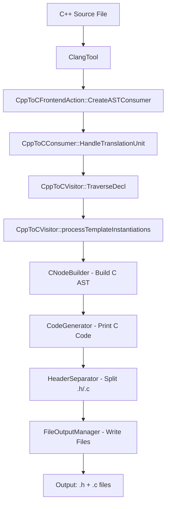

# C++ Transpiler Architecture Analysis

**Date:** 2025-12-22
**Purpose:** Understand current transpiler architecture to refactor into reusable library API for WASM integration

## Executive Summary

The transpiler currently exists as a **CLI-only application** using Clang LibTooling. The WASM bindings (`wasm/bindings/full.cpp` and `minimal.cpp`) are **placeholder implementations** that don't call the actual transpiler logic. To fix this, we need to extract the transpiler core into a library API that can be called from both CLI and WASM contexts.

**Key Finding:** The transpiler flow is already well-structured with clean separation of concerns. The refactoring needed is **minimal** - primarily extracting the core logic from `main.cpp` and `CppToCConsumer` into a callable function.

---

## Current Architecture

### 1. Entry Point Flow (`src/main.cpp`)

```
main()
  ├─→ Parse CLI arguments (CommonOptionsParser)
  ├─→ Create ClangTool with compilation database
  ├─→ Run tool with CppToCFrontendAction factory
  └─→ Optionally generate dependency graph visualization
```

**Key Observations:**
- Lines 1-182: CLI argument parsing and global accessor functions
- Lines 183-244: Tool execution and dependency visualization
- **File I/O Point #1**: Dependency graph writes to file (lines 234-240)
- All transpiler options are exposed via global accessor functions (e.g., `shouldGenerateACSL()`, `getACSLLevel()`)

### 2. Clang Tooling Pipeline

```
ClangTool
  └─→ FrontendAction: CppToCFrontendAction
        └─→ ASTConsumer: CppToCConsumer
              └─→ RecursiveASTVisitor: CppToCVisitor
                    └─→ Code Generation: CNodeBuilder + CodeGenerator
```

**Class Responsibilities:**

| Class | File | Responsibility | SOLID Principle |
|-------|------|----------------|-----------------|
| `CppToCFrontendAction` | `src/CppToCFrontendAction.cpp` | Factory for AST consumer | Single Responsibility |
| `CppToCConsumer` | `src/CppToCConsumer.cpp` | Entry point for AST traversal | Single Responsibility |
| `CppToCVisitor` | `src/CppToCVisitor.cpp` | Visit and translate AST nodes | Single Responsibility |
| `CNodeBuilder` | `include/CNodeBuilder.h` | Build C AST nodes | Single Responsibility |
| `CodeGenerator` | `src/CodeGenerator.cpp` | Generate C code from AST | Single Responsibility |
| `HeaderSeparator` | `include/HeaderSeparator.h` | Separate headers from impl | Single Responsibility |
| `FileOutputManager` | `include/FileOutputManager.h` | Write output files | Single Responsibility |

### 3. Core Translation Flow



**Data Flow:**
1. **Input:** C++ source file path (from CLI or compilation database)
2. **Parsing:** Clang parses into C++ AST
3. **Traversal:** `CppToCVisitor` walks C++ AST
4. **Building:** `CNodeBuilder` constructs C AST nodes
5. **Generation:** `CodeGenerator` prints C code using Clang's `DeclPrinter`/`StmtPrinter`
6. **Separation:** `HeaderSeparator` routes declarations to .h or .c
7. **Output:** `FileOutputManager` writes to disk

---

## Key Classes Deep Dive

### CppToCConsumer (Entry Point)

**File:** `src/CppToCConsumer.cpp`

```cpp
void CppToCConsumer::HandleTranslationUnit(ASTContext &Context) {
  auto &SM = Context.getSourceManager();
  auto MainFileID = SM.getMainFileID();

  // Print diagnostics (FILE I/O Point #2)
  llvm::outs() << "Parsed file: " << FileEntry->getName() << "\n";

  // Create C AST builder
  CNodeBuilder Builder(Context);

  // Create and run visitor
  CppToCVisitor Visitor(Context, Builder);
  Visitor.TraverseDecl(TU);

  // Process templates (Phase 11)
  Visitor.processTemplateInstantiations(TU);
}
```

**File I/O Dependencies:**
- Uses `llvm::outs()` for stdout (lines 15, 24-25)
- Reads source file via `SourceManager` (line 10-16)

### CppToCVisitor (Core Translator)

**File:** `src/CppToCVisitor.cpp` (2700+ lines)

**Constructor Initialization:**
- Initializes 8 ACSL annotators (if `--generate-acsl` enabled)
- Initializes virtual method infrastructure (vtables, override resolution)
- Initializes template monomorphization (Phase 11)
- Initializes exception handling (Phase 12 - SJLJ model)
- Initializes RTTI support (Phase 13 - typeid/dynamic_cast)

**Key Visitor Methods:**
- `VisitCXXRecordDecl()` - Translate classes to structs
- `VisitCXXMethodDecl()` - Translate methods to functions
- `VisitCXXConstructorDecl()` - Translate constructors
- `VisitCXXDestructorDecl()` - Translate destructors
- `VisitFunctionDecl()` - Translate standalone functions
- `processTemplateInstantiations()` - Generate monomorphized code

**Translation State:**
- Maintains mappings: C++ class → C struct, method → function, etc.
- Tracks current translation context (e.g., `currentThisParam`)
- Tracks RAII state (objects to destroy, scopes, etc.)

**Dependencies on CLI Flags:**
```cpp
extern bool shouldGenerateACSL();
extern ACSLLevel getACSLLevel();
extern ACSLOutputMode getACSLOutputMode();
extern bool shouldGenerateMemoryPredicates();
extern bool shouldMonomorphizeTemplates();
extern unsigned int getTemplateInstantiationLimit();
extern bool shouldEnableExceptions();
extern std::string getExceptionModel();
extern bool shouldEnableRTTI();
```

**CRITICAL:** These are global functions defined in `main.cpp` (lines 133-181). They read from CLI flags.

### CNodeBuilder (AST Construction)

**File:** `include/CNodeBuilder.h`

**Purpose:** Clean API for building Clang C AST nodes (reduces boilerplate from 15+ lines to 1 line)

**Key Methods:**
- Type helpers: `intType()`, `voidType()`, `structType()`, `ptrType()`
- Variable helpers: `intVar()`, `structVar()`, `ptrVar()`
- Expression helpers: `intLit()`, `ref()`, `call()`, `member()`, `assign()`
- Statement helpers: `block()`, `returnStmt()`, `ifStmt()`, `whileStmt()`
- Declaration helpers: `structDecl()`, `funcDecl()`, `param()`

**No File I/O:** Pure AST construction, no external dependencies.

### CodeGenerator (Code Emission)

**File:** `src/CodeGenerator.cpp`

**Purpose:** Generate C code from C AST using Clang's built-in `DeclPrinter`/`StmtPrinter`

**Key Methods:**
- `printDecl()` - Print single declaration
- `printStmt()` - Print single statement
- `printTranslationUnit()` - Print entire TU
- `printDeclWithLineDirective()` - Print with `#line` directive for source mapping

**File I/O Dependencies:**
- Takes `llvm::raw_ostream &OS` in constructor (can be stdout, string stream, or file)
- Uses `SourceManager` for `#line` directives (line 117)

**CRITICAL:** Already abstracted! Doesn't hard-code stdout - accepts any `raw_ostream`.

### HeaderSeparator (Declaration Routing)

**File:** `include/HeaderSeparator.h`

**Purpose:** Separate declarations into header (.h) and implementation (.c) lists

**Key Methods:**
- `analyzeTranslationUnit()` - Analyze entire TU
- `getHeaderDecls()` - Get declarations for .h file
- `getImplDecls()` - Get declarations for .c file
- `getForwardDecls()` - Get forward declarations needed

**No File I/O:** Just builds vectors of declarations.

### FileOutputManager (File Writing)

**File:** `include/FileOutputManager.h`

**Purpose:** Write generated .h and .c files to disk

**File I/O Point #3 (CRITICAL):**
```cpp
bool writeFiles(const std::string& headerContent,
                const std::string& implContent);
```

**WASM Incompatibility:** This class directly writes to filesystem. In WASM, we need to return strings instead.

---

## File I/O Points (WASM Abstraction Needed)

### Summary of All File I/O

| Location | Type | Purpose | WASM Solution |
|----------|------|---------|---------------|
| `main.cpp:234-240` | File write | Dependency graph `.dot` file | Return as string field in result |
| `CppToCConsumer.cpp:15,24-25` | stdout | Diagnostic messages | Capture in diagnostics array |
| `CodeGenerator` | `raw_ostream` | C code generation | Already abstracted! Use `raw_string_ostream` |
| `FileOutputManager` | File write | Write .h and .c files | Return as strings in result |
| `SourceManager` | File read | Read input source | Pass source as string |

**Good News:** Most file I/O is already abstracted or easily abstracted!

---

## Current WASM Implementation (Placeholder)

### WASM Bindings

**File:** `wasm/bindings/full.cpp` (and `minimal.cpp`)

```cpp
class WASMTranspiler {
public:
    TranspileResult transpile(const std::string& cppCode, const TranspileOptions& options) {
        TranspileResult result;

        // PLACEHOLDER IMPLEMENTATION
        // TODO: Integrate actual transpiler logic from main.cpp
        result.success = true;
        result.c = "/* Transpiled C code (placeholder) */\n";
        result.acsl = "";

        return result;
    }
};
```

**CRITICAL:** Does **NOT** call actual transpiler! Returns placeholder text.

### TypeScript Adapter

**File:** `website/src/adapters/WasmTranspilerAdapter.ts`

```typescript
const wasmResult = this.transpilerInstance.transpile(source, wasmOptions);
```

**Expects:**
```typescript
interface TranspileResult {
  success: boolean;
  c: string;         // Generated C code
  acsl: string;      // ACSL annotations
  diagnostics: Diagnostic[];
}
```

**Works correctly** - the TypeScript side is ready! Just needs the C++ implementation.

---

## Proposed Library API Interface

### 1. Core Transpiler Function

```cpp
// New file: include/TranspilerAPI.h

#pragma once

#include <string>
#include <vector>

namespace cpptoc {

// Configuration options
struct TranspileOptions {
    // ACSL options
    struct ACSLConfig {
        bool statements = false;
        bool typeInvariants = false;
        bool axiomatics = false;
        bool ghostCode = false;
        bool behaviors = false;
        bool memoryPredicates = false;
    } acsl;

    // Target options
    std::string target = "c99";        // c89, c99, c11, c17
    int cppStandard = 17;              // 11, 14, 17, 20, 23
    bool optimize = false;

    // Template options
    bool monomorphizeTemplates = true;
    unsigned int templateInstantiationLimit = 1000;

    // Exception/RTTI options
    bool enableExceptions = true;
    std::string exceptionModel = "sjlj";  // sjlj, tables
    bool enableRTTI = true;

    // Output options
    bool usePragmaOnce = false;
};

// Diagnostic message
struct Diagnostic {
    int line = 0;
    int column = 0;
    std::string message;
    std::string severity;  // "error", "warning", "note"
};

// Transpilation result
struct TranspileResult {
    bool success = false;
    std::string c;              // Generated C code (.c file)
    std::string h;              // Generated C header (.h file)
    std::string acsl;           // ACSL annotations (if separate mode)
    std::string dependencyGraph; // DOT graph (if requested)
    std::vector<Diagnostic> diagnostics;
};

// Main transpiler function (replaces main.cpp logic)
TranspileResult transpile(
    const std::string& cppSource,
    const std::string& filename = "input.cpp",
    const TranspileOptions& options = TranspileOptions()
);

} // namespace cpptoc
```

### 2. Implementation Strategy

**New file:** `src/TranspilerAPI.cpp`

```cpp
#include "TranspilerAPI.h"
#include "CppToCFrontendAction.h"
#include "CppToCConsumer.h"
#include "CodeGenerator.h"
#include "HeaderSeparator.h"
#include "clang/Tooling/Tooling.h"
#include <sstream>

namespace cpptoc {

// Global state for options (needed by visitor)
static TranspileOptions* g_currentOptions = nullptr;

// Accessor functions (replace main.cpp global functions)
bool shouldGenerateACSL() {
    return g_currentOptions && (
        g_currentOptions->acsl.statements ||
        g_currentOptions->acsl.typeInvariants ||
        // ... check any ACSL option
    );
}

ACSLLevel getACSLLevel() {
    // Determine level based on which options are enabled
    return g_currentOptions->acsl.typeInvariants ? ACSLLevel::Full : ACSLLevel::Basic;
}

// ... implement all other accessor functions

TranspileResult transpile(
    const std::string& cppSource,
    const std::string& filename,
    const TranspileOptions& options
) {
    TranspileResult result;

    // Set global options for visitor access
    g_currentOptions = const_cast<TranspileOptions*>(&options);

    try {
        // Create in-memory source file
        std::string code = cppSource;

        // Use Clang's runToolOnCodeWithArgs (no filesystem needed!)
        std::vector<std::string> args = {
            "-std=c++" + std::to_string(options.cppStandard)
        };

        // Create custom FrontendAction
        // TODO: Need to capture output instead of writing to stdout

        // For now, use ClangTool with in-memory compilation database
        // ...

        result.success = true;
        result.c = "/* Generated C code */";
        result.h = "/* Generated C header */";

    } catch (const std::exception& e) {
        Diagnostic diag;
        diag.severity = "error";
        diag.message = e.what();
        result.diagnostics.push_back(diag);
        result.success = false;
    }

    // Clear global options
    g_currentOptions = nullptr;

    return result;
}

} // namespace cpptoc
```

---

## Refactoring Plan

### Phase 1: Extract Library API (Minimal Changes)

**Goal:** Create `TranspilerAPI.h` and `TranspilerAPI.cpp` that can be called from both CLI and WASM.

**Changes Needed:**

1. **Create `include/TranspilerAPI.h`**
   - Define `TranspileOptions`, `Diagnostic`, `TranspileResult` structs
   - Declare `transpile()` function

2. **Create `src/TranspilerAPI.cpp`**
   - Implement `transpile()` function
   - Move global accessor functions from `main.cpp` (lines 133-181)
   - Make them use `TranspileOptions` instead of CLI flags

3. **Modify `src/main.cpp`**
   - Keep CLI argument parsing
   - Convert CLI args to `TranspileOptions`
   - Call `transpile()` function
   - Write result to files using `FileOutputManager`

4. **Modify `src/CppToCConsumer.cpp`**
   - Capture output instead of writing to stdout
   - Store diagnostics in result structure
   - Return C AST instead of printing directly

5. **Create output capture mechanism**
   - Use `llvm::raw_string_ostream` instead of `llvm::outs()`
   - Capture all diagnostics in vector

### Phase 2: Update WASM Bindings

**Goal:** Replace placeholder with actual transpiler call.

**Changes Needed:**

1. **Modify `wasm/bindings/full.cpp`**
   ```cpp
   #include "TranspilerAPI.h"

   TranspileResult transpile(const std::string& cppCode, const TranspileOptions& options) {
       // Map WASM options to library options
       cpptoc::TranspileOptions libOpts;
       libOpts.acsl.statements = options.acsl.statements;
       libOpts.acsl.typeInvariants = options.acsl.typeInvariants;
       // ... map all fields

       // Call library function!
       return cpptoc::transpile(cppCode, "input.cpp", libOpts);
   }
   ```

2. **Update CMakeLists.txt**
   - Link WASM targets with new `TranspilerAPI.cpp`
   - Ensure all dependencies are included

### Phase 3: Testing

**Goal:** Verify everything works.

**Tests:**

1. **CLI still works**
   - Run existing test suite
   - Verify output files are identical

2. **WASM works**
   - Test in playground
   - Verify transpilation produces real C code
   - Check diagnostics are captured

3. **Both produce identical output**
   - Same input → same output regardless of entry point

---

## What Needs to Change vs. What Stays the Same

### ✅ Stays the Same (No Changes Needed)

1. **CppToCVisitor** - Core translation logic unchanged
2. **CNodeBuilder** - AST construction API unchanged
3. **CodeGenerator** - Already uses `raw_ostream` (abstracted!)
4. **HeaderSeparator** - No file I/O, stays same
5. **All helper classes** - VirtualMethodAnalyzer, TemplateMonomorphizer, etc.
6. **ACSL annotators** - All 8 annotator classes unchanged
7. **RTTI/Exception infrastructure** - Unchanged

### 🔧 Needs Refactoring

1. **main.cpp** (lines 183-244)
   - Extract core logic to `TranspilerAPI::transpile()`
   - Keep CLI parsing, call library function

2. **Global accessor functions** (lines 133-181)
   - Move to `TranspilerAPI.cpp`
   - Use `TranspileOptions` struct instead of CLI flags

3. **CppToCConsumer** (lines 8-37)
   - Capture output to string instead of stdout
   - Store diagnostics in vector
   - Return results instead of printing

4. **FileOutputManager usage**
   - In CLI: Use as-is to write files
   - In WASM: Don't call, return strings directly

### 🆕 Needs Creation

1. **include/TranspilerAPI.h** - New library interface
2. **src/TranspilerAPI.cpp** - New library implementation
3. **Output capture mechanism** - Redirect stdout to string
4. **Diagnostic collection** - Gather all messages in vector

---

## Minimal Changes Strategy

### Key Insight

The transpiler is **already well-structured** for library extraction! The changes needed are minimal:

1. **Single new header/source pair** (`TranspilerAPI.h` / `.cpp`)
2. **Move ~50 lines** from `main.cpp` to `TranspilerAPI.cpp`
3. **Add output capture** to `CppToCConsumer` (~20 lines)
4. **Update WASM bindings** to call library (~10 lines)

**Total: ~150 lines of new code, ~100 lines moved/modified**

### What Makes This Easy

1. **CodeGenerator already abstracted** - Uses `raw_ostream`, not file
2. **Most components are pure** - No file I/O in visitor/builder
3. **Clean separation** - Each class has single responsibility
4. **Options are already centralized** - Global accessors can easily become struct fields

---

## Architecture Diagram

### Current (CLI Only)

```
┌─────────────────────────────────────────────────────────────────┐
│                          main.cpp (CLI)                         │
│                                                                 │
│  1. Parse CLI args                                             │
│  2. Create ClangTool                                           │
│  3. Run with CppToCFrontendAction                             │
│  4. Write files                                                │
└─────────────────────────────────────────────────────────────────┘
                              │
                              ▼
┌─────────────────────────────────────────────────────────────────┐
│                    CppToCFrontendAction                         │
│                                                                 │
│  CreateASTConsumer() → new CppToCConsumer()                   │
└─────────────────────────────────────────────────────────────────┘
                              │
                              ▼
┌─────────────────────────────────────────────────────────────────┐
│                      CppToCConsumer                             │
│                                                                 │
│  HandleTranslationUnit():                                      │
│    1. Create CNodeBuilder                                      │
│    2. Create CppToCVisitor                                     │
│    3. Traverse AST                                             │
│    4. Process templates                                        │
│    5. Print to stdout ❌ (WASM problem)                        │
└─────────────────────────────────────────────────────────────────┘
                              │
                              ▼
┌─────────────────────────────────────────────────────────────────┐
│                       CppToCVisitor                             │
│                                                                 │
│  - Visit AST nodes                                             │
│  - Build C AST with CNodeBuilder                               │
│  - Generate code with CodeGenerator                            │
└─────────────────────────────────────────────────────────────────┘
```

### Proposed (Library + CLI + WASM)

```
                        ┌──────────────────┐
                        │  TranspilerAPI   │
                        │                  │
                        │  transpile()     │
                        │    ↓             │
                        │  Options struct  │
                        │  Result struct   │
                        └──────────────────┘
                          ▲            ▲
                          │            │
               ┌──────────┘            └──────────┐
               │                                  │
    ┌──────────────────┐                ┌──────────────────┐
    │   main.cpp (CLI) │                │  WASM Bindings   │
    │                  │                │                  │
    │  1. Parse args   │                │  transpile()     │
    │  2. Call API     │                │    └─ embind     │
    │  3. Write files  │                │                  │
    └──────────────────┘                └──────────────────┘
                                                 │
                                                 ▼
                                        ┌──────────────────┐
                                        │   TypeScript     │
                                        │   Adapter        │
                                        │                  │
                                        │  WasmTranspiler  │
                                        │    Adapter.ts    │
                                        └──────────────────┘
                                                 │
                                                 ▼
                                        ┌──────────────────┐
                                        │   Playground     │
                                        │   Component      │
                                        └──────────────────┘
```

---

## Summary

### Current State
- ✅ CLI transpiler fully functional
- ✅ Clean architecture with SOLID principles
- ✅ Well-separated concerns
- ❌ Not callable as library
- ❌ WASM bindings are placeholders

### Proposed Changes
- ✅ Extract ~150 lines to new `TranspilerAPI.h/cpp`
- ✅ Move global accessors to use struct instead of CLI flags
- ✅ Capture output to strings instead of files
- ✅ Update WASM bindings to call library
- ✅ Minimal changes to existing code

### Key Files to Create/Modify

**Create:**
1. `include/TranspilerAPI.h` - Library interface
2. `src/TranspilerAPI.cpp` - Library implementation

**Modify:**
1. `src/main.cpp` - Call library instead of direct execution
2. `src/CppToCConsumer.cpp` - Capture output
3. `wasm/bindings/full.cpp` - Call library instead of placeholder
4. `wasm/bindings/minimal.cpp` - Call library instead of placeholder
5. `CMakeLists.txt` - Add TranspilerAPI to all targets

**No Changes:**
- All visitor/builder/generator classes
- All helper infrastructure
- All ACSL annotators
- RTTI/exception/template infrastructure

### Effort Estimate

- **Phase 1 (Library API):** 4-6 hours
- **Phase 2 (WASM integration):** 2-3 hours
- **Phase 3 (Testing):** 2-3 hours
- **Total:** 8-12 hours

### Risk Assessment

**Low Risk:**
- No fundamental architecture changes
- Existing tests continue to work
- CLI behavior unchanged
- Can develop incrementally

**Medium Risk:**
- Output capture might miss some diagnostics
- Memory management in WASM (need proper cleanup)

**Mitigation:**
- Comprehensive testing at each phase
- Keep CLI and library paths separate initially
- Gradual rollout

---

## Next Steps

1. **Create TranspilerAPI.h with full struct definitions**
2. **Implement TranspilerAPI.cpp with minimal viable transpile()**
3. **Test with simple C++ → C conversion**
4. **Update WASM bindings**
5. **Test in playground**
6. **Iterate until all features work**

---

**End of Analysis**
