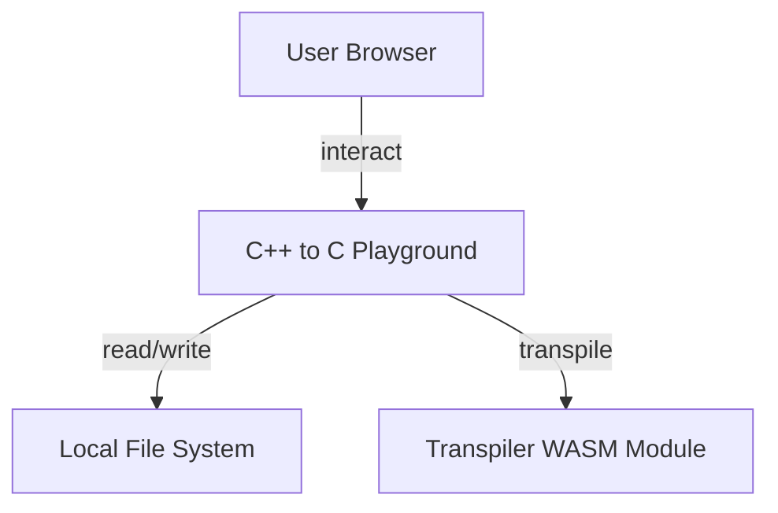
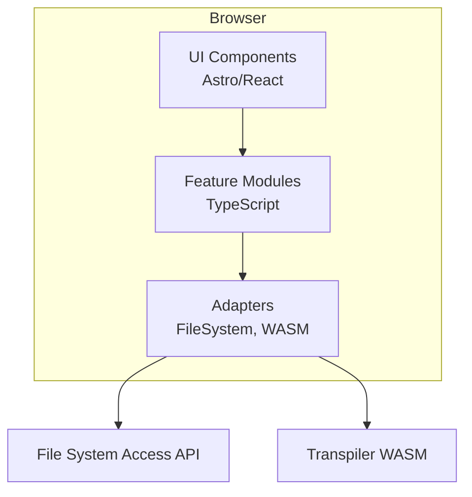
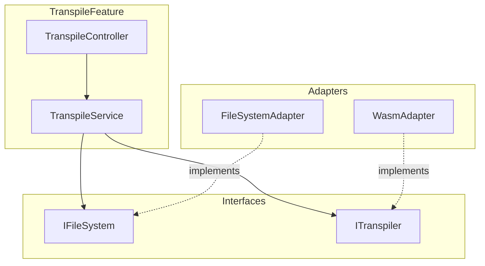
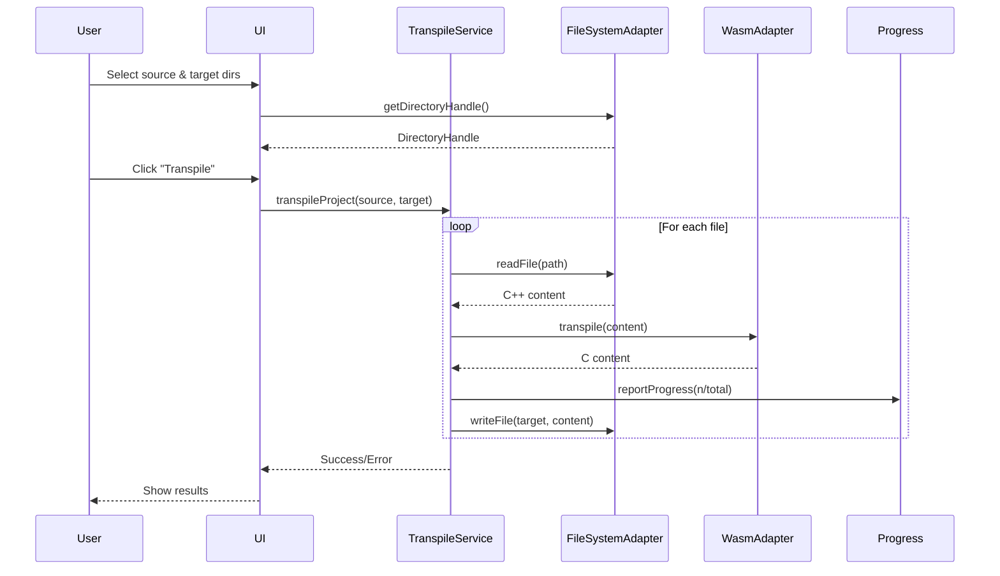
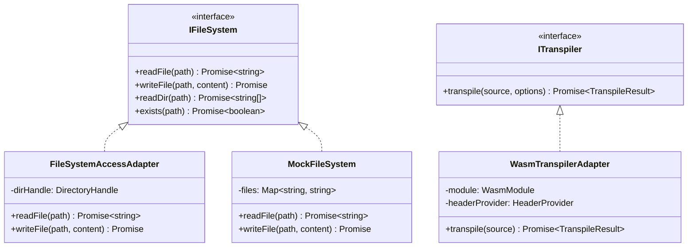
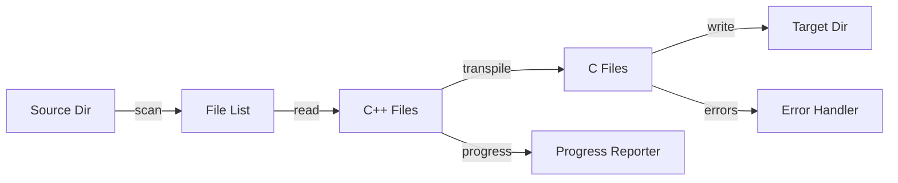

# C++ to C Playground Web Interface - Architecture Plan

<objective>
Create comprehensive architecture plan for C++ to C transpilation playground web interface.

Purpose: Design production-ready architecture using vertical slicing, SOLID principles, and testable patterns
Input: Research findings on File System Access API, WASM integration, testing abstractions
Output: playground-cpp-to-c-plan.md with Mermaid diagrams, vertical slices, and implementation roadmap
</objective>

<context>
Research findings: @.prompts/014-playground-cpp-to-c-research/playground-cpp-to-c-research.md

Existing WASM implementation:
- @wasm/glue/src/index.ts
- @wasm/glue/src/types.ts
- @wasm/glue/src/headers/stdlib-provider.ts

Phase 16-04 findings:
- @.planning/phases/16-runtime-integration-testing/16-04-SUMMARY.md

Current website:
- @src/pages/ (Astro framework)
- @src/components/
</context>

<planning_requirements>
**Architecture Design**:
- Use Mermaid diagrams for all architectural views
- Apply vertical slice architecture (organize by feature, not layer)
- Follow SOLID principles throughout
- Design for testability (dependency injection, interfaces)
- Support both File System Access API and fallback mechanisms

**Key Capabilities**:
1. Directory selection (drag-drop or click-to-select)
2. Source directory (C++ input)
3. Target directory (C output)
4. Recursive file traversal and processing
5. Progress indication for large projects
6. Error handling and reporting
7. Result validation (compilable C99 output)

**Technical Constraints**:
- Browser-based (no mandatory backend)
- Work with File System Access API where available
- Graceful degradation for unsupported browsers
- WASM transpiler integration
- Server-side preprocessing for header provisioning (from Phase 16-04)
- Testable with unit and integration tests

**Non-Functional Requirements**:
- Handle projects up to 500 files
- Provide progress feedback every 100ms
- Support cancellation of long-running operations
- Preserve directory structure in output
- Generate build-ready C99 projects

**Testing Strategy**:
- Unit tests with mock filesystem
- Integration tests with in-memory filesystem
- E2E tests with File System Access API (where supported)
- Performance tests with synthetic projects (10, 50, 100, 500 files)
</planning_requirements>

<architecture_requirements>
**Vertical Slice Organization**:
Organize by feature capability, not technical layer:
```
src/features/
├── transpile/
│   ├── TranspileFeature.ts           # Feature orchestrator
│   ├── transpile.service.ts          # Business logic
│   ├── transpile.service.test.ts     # Tests
│   └── transpile.types.ts            # Feature types
├── file-selection/
│   ├── FileSelectionFeature.ts
│   ├── file-selection.service.ts
│   └── file-selection.types.ts
└── progress/
    ├── ProgressFeature.ts
    ├── progress.service.ts
    └── progress.types.ts
```

**Abstraction Layers**:
1. **Feature Layer**: High-level capabilities (TranspileFeature)
2. **Service Layer**: Business logic (TranspileService)
3. **Adapter Layer**: External integrations (FileSystemAdapter, WasmAdapter)
4. **Domain Layer**: Core types and interfaces

**Dependency Injection**:
Use constructor injection for all dependencies:
```typescript
class TranspileService {
  constructor(
    private fileSystem: IFileSystem,
    private transpiler: ITranspiler,
    private progress: IProgressReporter
  ) {}
}
```

**Interface-Driven Design**:
Define interfaces for all external dependencies:
- IFileSystem (file I/O abstraction)
- ITranspiler (WASM transpiler)
- IProgressReporter (progress updates)
- IErrorHandler (error management)
</architecture_requirements>

<diagram_requirements>
Create comprehensive Mermaid diagrams for:

1. **System Context Diagram**: Overall playground in browser ecosystem
2. **Container Diagram**: Major components (UI, File System, WASM, Services)
3. **Component Diagram**: Detailed feature breakdown with dependencies
4. **Sequence Diagram**: End-to-end transpilation flow
5. **Class Diagram**: Key interfaces and implementations
6. **Data Flow Diagram**: File processing pipeline

Each diagram must be:
- Valid Mermaid syntax
- Clearly labeled with relationships
- Focused on architectural decisions
- Annotated with key patterns (Adapter, Strategy, Observer)
</diagram_requirements>

<output_structure>
Save to: `.prompts/015-playground-cpp-to-c-plan/playground-cpp-to-c-plan.md`

Structure the plan using this XML format:

```xml
<plan>
  <summary>
    {One paragraph overview of the architecture approach}
    {Key patterns: Vertical Slicing, Dependency Injection, Adapter}
    {Technology stack: TypeScript, Astro, WASM, File System Access API}
  </summary>

  <architecture>
    <overview>
      {High-level architectural vision}
      {Vertical slice organization rationale}
      {SOLID principles application}
    </overview>

    <diagrams>
      <diagram type="system-context">

      </diagram>

      <diagram type="container">

      </diagram>

      <diagram type="component">

      </diagram>

      <diagram type="sequence">

      </diagram>

      <diagram type="class">

      </diagram>

      <diagram type="data-flow">

      </diagram>
    </diagrams>

    <vertical_slices>
      <slice name="file-selection">
        <responsibility>Handle source and target directory selection</responsibility>
        <components>
          - FileSelectionFeature (orchestrator)
          - FileSelectionService (business logic)
          - DirectoryPickerAdapter (File System Access API)
        </components>
        <interfaces>
          - IDirectoryPicker
        </interfaces>
      </slice>

      <slice name="transpile">
        <responsibility>Orchestrate file-by-file transpilation</responsibility>
        <components>
          - TranspileFeature
          - TranspileService
          - FileSystemAdapter
          - WasmAdapter
        </components>
        <interfaces>
          - IFileSystem
          - ITranspiler
          - IProgressReporter
        </interfaces>
      </slice>

      <slice name="progress">
        <responsibility>Report progress and handle cancellation</responsibility>
        <components>
          - ProgressFeature
          - ProgressService
        </components>
        <interfaces>
          - IProgressReporter
          - ICancellationToken
        </interfaces>
      </slice>

      <slice name="validation">
        <responsibility>Validate transpiled output</responsibility>
        <components>
          - ValidationFeature
          - ValidationService
        </components>
        <interfaces>
          - IValidator
        </interfaces>
      </slice>
    </vertical_slices>

    <solid_principles>
      <principle name="Single Responsibility">
        - Each feature handles one capability
        - Services contain business logic only
        - Adapters handle external integration only
      </principle>

      <principle name="Open/Closed">
        - New file system backends via IFileSystem
        - New transpilers via ITranspiler
        - No modification to core services
      </principle>

      <principle name="Liskov Substitution">
        - MockFileSystem substitutes FileSystemAccessAdapter
        - All IFileSystem implementations interchangeable
      </principle>

      <principle name="Interface Segregation">
        - IFileSystem has minimal methods
        - ITranspiler focused on transpilation only
        - IProgressReporter separate from business logic
      </principle>

      <principle name="Dependency Inversion">
        - Services depend on interfaces, not implementations
        - Dependency injection in constructors
        - No direct instantiation of adapters
      </principle>
    </solid_principles>
  </architecture>

  <phases>
    <phase number="1" name="foundation">
      <objective>Create core interfaces and infrastructure</objective>
      <tasks>
        <task priority="high">Define IFileSystem, ITranspiler, IProgressReporter interfaces</task>
        <task priority="high">Create MockFileSystem for testing</task>
        <task priority="high">Set up test infrastructure (Vitest, test utilities)</task>
        <task priority="medium">Create base feature and service abstract classes</task>
      </tasks>
      <deliverables>
        <deliverable>src/core/interfaces/ with all interface definitions</deliverable>
        <deliverable>src/adapters/MockFileSystem.ts</deliverable>
        <deliverable>Test infrastructure configured</deliverable>
      </deliverables>
      <dependencies>None - foundation phase</dependencies>
      <tests>
        - MockFileSystem unit tests
        - Interface contracts validated
      </tests>
    </phase>

    <phase number="2" name="wasm-integration">
      <objective>Integrate existing WASM transpiler module</objective>
      <tasks>
        <task priority="high">Create WasmTranspilerAdapter implementing ITranspiler</task>
        <task priority="high">Integrate HeaderProvider from Phase 16-04</task>
        <task priority="medium">Add error handling and diagnostics</task>
        <task priority="medium">Create unit tests with mock WASM module</task>
      </tasks>
      <deliverables>
        <deliverable>src/adapters/WasmTranspilerAdapter.ts</deliverable>
        <deliverable>Integration with @wasm/glue TypeScript API</deliverable>
        <deliverable>Unit tests with 100% coverage</deliverable>
      </deliverables>
      <dependencies>Phase 1 complete (ITranspiler interface)</dependencies>
      <tests>
        - WasmAdapter unit tests (mocked WASM)
        - Header provisioning tests
        - Error handling tests
      </tests>
    </phase>

    <phase number="3" name="file-system-adapter">
      <objective>Implement File System Access API adapter</objective>
      <tasks>
        <task priority="high">Create FileSystemAccessAdapter implementing IFileSystem</task>
        <task priority="high">Implement directory traversal (recursive)</task>
        <task priority="high">Handle permissions and errors</task>
        <task priority="medium">Add fallback for unsupported browsers</task>
        <task priority="low">Optimize for large directories (parallel reads)</task>
      </tasks>
      <deliverables>
        <deliverable>src/adapters/FileSystemAccessAdapter.ts</deliverable>
        <deliverable>Browser compatibility detection</deliverable>
        <deliverable>Integration tests (E2E with real API)</deliverable>
      </deliverables>
      <dependencies>Phase 1 complete (IFileSystem interface)</dependencies>
      <tests>
        - Unit tests with mocked File System Access API
        - Integration tests with temporary directories
        - Permission handling tests
      </tests>
    </phase>

    <phase number="4" name="transpile-service">
      <objective>Implement core transpilation orchestration</objective>
      <tasks>
        <task priority="high">Create TranspileService with TDD</task>
        <task priority="high">Implement file-by-file processing pipeline</task>
        <task priority="high">Add progress reporting</task>
        <task priority="high">Implement cancellation support</task>
        <task priority="medium">Handle errors and continue processing</task>
        <task priority="medium">Preserve directory structure</task>
      </tasks>
      <deliverables>
        <deliverable>src/features/transpile/TranspileService.ts</deliverable>
        <deliverable>src/features/transpile/TranspileService.test.ts</deliverable>
        <deliverable>100% test coverage with mock dependencies</deliverable>
      </deliverables>
      <dependencies>Phases 1, 2, 3 complete</dependencies>
      <tests>
        - Unit tests with MockFileSystem and mock transpiler
        - Progress reporting tests
        - Cancellation tests
        - Error handling tests (continue on error)
        - Directory structure preservation tests
      </tests>
    </phase>

    <phase number="5" name="ui-components">
      <objective>Create user interface components</objective>
      <tasks>
        <task priority="high">Directory selection UI (drag-drop + button)</task>
        <task priority="high">Progress indicator component</task>
        <task priority="high">Error display component</task>
        <task priority="medium">Results summary component</task>
        <task priority="low">Project structure visualization</task>
      </tasks>
      <deliverables>
        <deliverable>src/components/DirectorySelector.tsx</deliverable>
        <deliverable>src/components/ProgressIndicator.tsx</deliverable>
        <deliverable>src/components/ErrorDisplay.tsx</deliverable>
        <deliverable>Component tests with React Testing Library</deliverable>
      </deliverables>
      <dependencies>Phase 4 complete (services ready)</dependencies>
      <tests>
        - Component unit tests
        - User interaction tests
        - Accessibility tests
      </tests>
    </phase>

    <phase number="6" name="integration">
      <objective>Wire everything together and test end-to-end</objective>
      <tasks>
        <task priority="high">Create PlaygroundPage integrating all features</task>
        <task priority="high">Dependency injection setup</task>
        <task priority="high">End-to-end tests with synthetic projects</task>
        <task priority="medium">Performance testing (500 file project)</task>
        <task priority="medium">Browser compatibility testing</task>
      </tasks>
      <deliverables>
        <deliverable>src/pages/playground.astro</deliverable>
        <deliverable>E2E test suite</deliverable>
        <deliverable>Performance benchmarks</deliverable>
      </deliverables>
      <dependencies>All previous phases complete</dependencies>
      <tests>
        - E2E tests with 10, 50, 100, 500 file projects
        - Performance tests (files/second)
        - Cross-browser tests (Chrome, Edge, Firefox)
        - Error scenario tests (permissions, disk space)
      </tests>
    </phase>
  </phases>

  <testing_strategy>
    <unit_tests>
      - All services tested in isolation with mocked dependencies
      - MockFileSystem for file I/O testing
      - Mock transpiler for business logic testing
      - Target: 100% line coverage
    </unit_tests>

    <integration_tests>
      - FileSystemAccessAdapter with temporary directories
      - WasmTranspilerAdapter with actual WASM module
      - Full pipeline tests with in-memory filesystem
      - Target: All critical paths covered
    </integration_tests>

    <e2e_tests>
      - Playwright tests with File System Access API
      - Synthetic C++ projects (10, 50, 100, 500 files)
      - Error scenarios (invalid files, permissions)
      - Browser compatibility suite
      - Target: Core user flows verified
    </e2e_tests>

    <performance_tests>
      - Measure files/second throughput
      - Test with 500 file project
      - Memory usage profiling
      - Progress reporting accuracy
      - Target: <5s for 100 files, <60s for 500 files
    </performance_tests>
  </testing_strategy>

  <technology_stack>
    <frontend>
      - Astro (existing framework)
      - React (for interactive components)
      - TypeScript (strict mode)
    </frontend>

    <transpiler>
      - WASM module from @wasm/glue
      - HeaderProvider from Phase 16-04
      - Server-side preprocessing option
    </transpiler>

    <file_system>
      - File System Access API (primary)
      - Fallback: manual file upload (future)
    </file_system>

    <testing>
      - Vitest (unit tests)
      - React Testing Library (components)
      - Playwright (E2E)
      - memfs (mock filesystem)
    </testing>

    <development>
      - Vite (build tool)
      - ESLint + Prettier
      - TypeScript strict mode
    </development>
  </technology_stack>

  <metadata>
    <confidence level="high">
      Architecture based on established patterns (Vertical Slicing, SOLID)
      File System Access API well-documented
      WASM integration verified from Phase 16-04
      Testing strategy proven
    </confidence>

    <dependencies>
      - File System Access API (Chrome 86+, Edge 86+)
      - WASM support (all modern browsers)
      - TypeScript 5.0+
      - Astro framework already in use
    </dependencies>

    <open_questions>
      - Should we support mobile browsers? (File System Access API limited)
      - Offline mode requirement? (WASM can work offline, but header provisioning?)
      - Maximum project size limit? (Recommend 500 files, test to verify)
    </open_questions>

    <assumptions>
      - Users have modern desktop browsers (Chrome/Edge primary)
      - Projects typically <500 files
      - Internet connection for initial WASM load
      - Local filesystem access granted by user
      - No server-side processing required (optional for headers)
    </assumptions>
  </metadata>
</plan>
```
</output_structure>

<summary_requirements>
Create `.prompts/015-playground-cpp-to-c-plan/SUMMARY.md`

```markdown
# C++ to C Playground Architecture Plan Summary

**{Substantive one-liner: e.g., "Vertical slice architecture with 6 phases, File System Access API + WASM integration"}**

## Version
v1

## Key Findings
- {Architecture approach: Vertical slicing, SOLID, DI}
- {Key technology: File System Access API + existing WASM module}
- {Testing strategy: Unit, integration, E2E with mock filesystem}
- {6 implementation phases with clear dependencies}

## Decisions Needed
{Specific architectural choices requiring validation}
- Mobile browser support priority?
- Offline mode requirement?
- Maximum project size limit (recommend 500 files)?

## Blockers
None

## Next Step
Execute Phase 1: Foundation (interfaces, mock filesystem, test infrastructure)

---
*Confidence: High*
*Full output: playground-cpp-to-c-plan.md*
```
</summary_requirements>

<success_criteria>
- Plan addresses all requirements from research
- Architecture uses vertical slicing organization
- SOLID principles applied throughout
- All 6 Mermaid diagrams created with valid syntax
- Phases are sequential and independently executable
- Each phase has clear deliverables and tests
- Testing strategy covers unit, integration, E2E, performance
- Dependency injection patterns specified
- Interface definitions complete
- Metadata captures assumptions and open questions
- SUMMARY.md created with phase overview
- Ready for TDD implementation to consume
</success_criteria>
