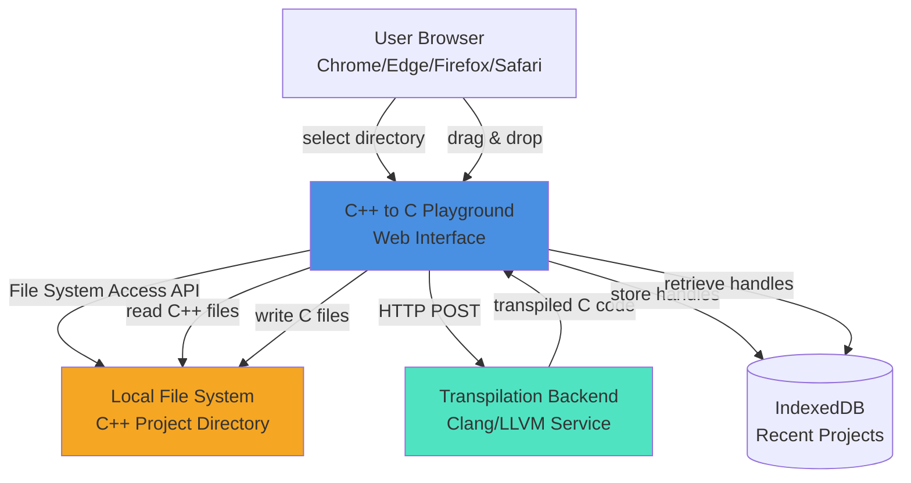
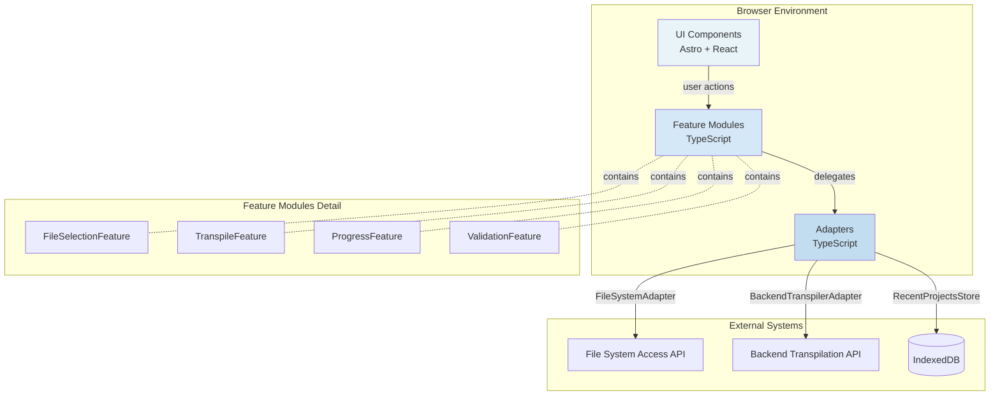
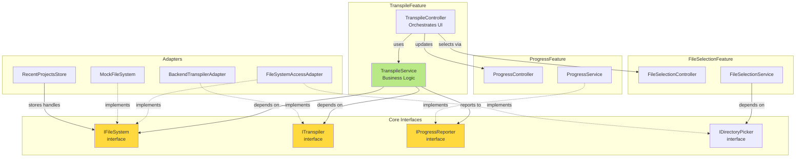
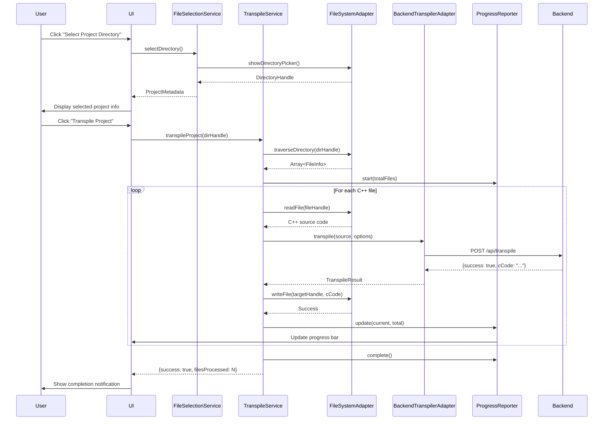
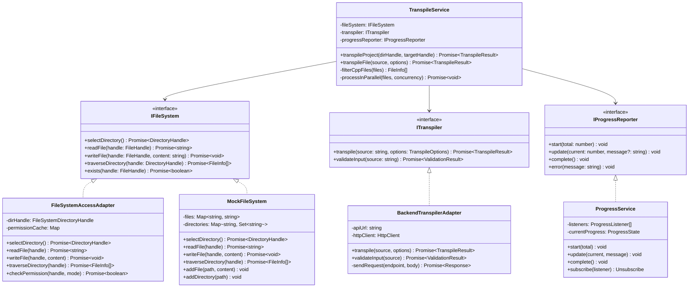
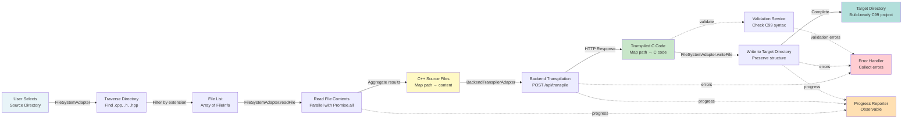

# C++ to C Playground Web Interface - Architecture Plan

<plan>
  <summary>
This architecture plan establishes a production-ready web-based C++ to C transpilation playground using vertical slice architecture, SOLID principles, and progressive enhancement patterns. The design leverages the File System Access API for intuitive directory selection on Chromium browsers, server-side transpilation using the existing Clang/LLVM backend, and comprehensive fallback mechanisms for cross-browser compatibility. Key architectural patterns include vertical slicing (organizing by feature capability rather than technical layer), dependency injection for testability, and interface-driven design enabling TDD with mock implementations. The technology stack combines TypeScript for type safety, Astro for the web framework, browser-fs-access for progressive enhancement, and memfs-browser for fast deterministic unit testing. The implementation is structured in 6 phases: foundation (interfaces and mock infrastructure), WASM integration (adapter for existing transpiler), file system adapter (File System Access API integration), transpile service (core orchestration), UI components (React components for interaction), and final integration with end-to-end testing.
  </summary>

  <architecture>
    <overview>
The playground architecture follows vertical slice organization, where each feature encapsulates its complete stack from UI to external integration. This approach differs from traditional horizontal layering (UI layer, business layer, data layer) by organizing code around feature capabilities like "file selection," "transpilation," and "progress reporting." Each vertical slice contains its own service logic, adapters, and interfaces, minimizing inter-feature dependencies and enabling independent testing and deployment.

SOLID principles are applied rigorously throughout:
- **Single Responsibility**: Each class has one reason to change (TranspileService handles transpilation orchestration only, FileSystemAdapter handles file I/O only)
- **Open/Closed**: New file system backends can be added by implementing IFileSystem without modifying existing code
- **Liskov Substitution**: MockFileSystem can replace FileSystemAccessAdapter in tests without breaking contracts
- **Interface Segregation**: Interfaces are focused and minimal (IFileSystem defines only essential file operations)
- **Dependency Inversion**: High-level services depend on abstractions (IFileSystem, ITranspiler) rather than concrete implementations

The architecture supports three browser tiers with progressive enhancement:
- **Tier 1** (Chrome/Edge 105+): Full File System Access API with directory picker, drag-drop, write-back capability, and IndexedDB recent projects
- **Tier 2** (Firefox/Safari desktop): Read-only directory traversal via webkitdirectory fallback, download-only output
- **Tier 3** (Mobile browsers): Single file upload/download, basic transpilation

Server-side transpilation architecture (from Phase 16-04) keeps the browser bundle lightweight by offloading heavy Clang/LLVM processing to the backend. The browser handles file I/O, directory traversal, and UI interactions, while the server performs actual transpilation with full C++ language support.
    </overview>

    <diagrams>
      <diagram type="system-context">

      </diagram>

      <diagram type="container">

      </diagram>

      <diagram type="component">

      </diagram>

      <diagram type="sequence">

      </diagram>

      <diagram type="class">

      </diagram>

      <diagram type="data-flow">

      </diagram>
    </diagrams>

    <vertical_slices>
      <slice name="file-selection">
        <responsibility>
Handle source and target directory selection through File System Access API picker, drag-and-drop, or fallback mechanisms. Manage directory permissions, validate selected directories, and persist recent projects to IndexedDB.
        </responsibility>
        <components>
          - FileSelectionFeature (orchestrator, coordinates UI and service)
          - FileSelectionService (business logic for directory validation and filtering)
          - DirectoryPickerAdapter (wraps File System Access API showDirectoryPicker)
          - DragDropHandler (handles DataTransferItem.getAsFileSystemHandle)
          - RecentProjectsStore (IndexedDB persistence for directory handles)
        </components>
        <interfaces>
          - IDirectoryPicker (abstraction for directory selection mechanism)
          - IRecentProjectsStore (abstraction for persistence layer)
        </interfaces>
        <testing>
          - Unit tests with MockDirectoryPicker returning synthetic directory handles
          - Integration tests with browser-fs-access library fallbacks
          - E2E tests with real File System Access API on Chrome
        </testing>
        <dependencies>
          - None (foundation slice)
        </dependencies>
      </slice>

      <slice name="file-system">
        <responsibility>
Abstract file system operations (read, write, traverse) to enable testing and support multiple backends (File System Access API, mock filesystem, future OPFS). Provide recursive directory traversal, file filtering by extension, and permission management.
        </responsibility>
        <components>
          - FileSystemAccessAdapter (production implementation using File System Access API)
          - MockFileSystem (test implementation using in-memory maps)
          - FileSystemUtils (helper functions for path manipulation, extension filtering)
        </components>
        <interfaces>
          - IFileSystem (core abstraction: readFile, writeFile, traverseDirectory, exists)
          - DirectoryHandle, FileHandle (wrapper interfaces for type safety)
        </interfaces>
        <testing>
          - Unit tests with MockFileSystem for all file operations
          - Integration tests with temporary directories via File System Access API
          - Performance tests with synthetic projects (10, 50, 100, 500 files)
        </testing>
        <dependencies>
          - None (foundation slice)
        </dependencies>
      </slice>

      <slice name="transpile">
        <responsibility>
Orchestrate file-by-file transpilation of C++ projects to C99. Coordinate file reading, backend transpilation API calls, progress reporting, error handling, and result writing. Support parallel processing for large projects and cancellation for long-running operations.
        </responsibility>
        <components>
          - TranspileFeature (orchestrator, wires UI to service)
          - TranspileService (core business logic, file processing pipeline)
          - BackendTranspilerAdapter (HTTP client for backend API)
          - TranspileQueue (manages parallel processing with concurrency limits)
        </components>
        <interfaces>
          - ITranspiler (abstraction for transpilation engine)
          - ICancellationToken (support for aborting operations)
        </interfaces>
        <testing>
          - Unit tests with MockFileSystem and mock transpiler
          - Integration tests with real backend API
          - E2E tests with sample C++ projects
          - Performance tests measuring files/second throughput
          - Cancellation tests verifying clean abort
        </testing>
        <dependencies>
          - file-system slice (IFileSystem dependency)
          - progress slice (IProgressReporter dependency)
        </dependencies>
      </slice>

      <slice name="progress">
        <responsibility>
Report progress and status updates to the UI during long-running operations. Support multiple concurrent operations, cancellation requests, and error notifications. Provide observable pattern for real-time UI updates.
        </responsibility>
        <components>
          - ProgressFeature (UI integration, renders progress bars)
          - ProgressService (observable implementation with pub/sub)
          - ProgressState (immutable state object)
        </components>
        <interfaces>
          - IProgressReporter (abstraction for progress updates)
          - ICancellationToken (abstraction for abort signals)
        </interfaces>
        <testing>
          - Unit tests with mock subscribers
          - Integration tests with UI components (React Testing Library)
          - E2E tests verifying progress accuracy during actual transpilation
        </testing>
        <dependencies>
          - None (foundation slice)
        </dependencies>
      </slice>

      <slice name="validation">
        <responsibility>
Validate transpiled C output for syntax correctness, C99 compliance, and build readiness. Optional integration with C compiler (gcc/clang) for verification. Report validation errors with file/line information.
        </responsibility>
        <components>
          - ValidationFeature (orchestrator for validation UI)
          - ValidationService (C99 syntax checker, optional compiler integration)
          - SyntaxValidator (basic C syntax validation without full parsing)
        </components>
        <interfaces>
          - IValidator (abstraction for validation logic)
        </interfaces>
        <testing>
          - Unit tests with valid and invalid C code samples
          - Integration tests with gcc/clang if available
          - E2E tests validating transpiled output compiles successfully
        </testing>
        <dependencies>
          - None (can run independently on transpilation output)
        </dependencies>
      </slice>

      <slice name="browser-compatibility">
        <responsibility>
Detect browser capabilities (File System Access API support, drag-and-drop variants), provide progressive enhancement, and display appropriate UI based on tier (Tier 1: Chrome/Edge full features, Tier 2: Firefox/Safari read-only, Tier 3: Mobile single file).
        </responsibility>
        <components>
          - BrowserDetectionService (feature detection for File System Access API)
          - FallbackProviderFactory (selects appropriate adapter based on browser)
          - CompatibilityBanner (UI component showing browser limitations)
        </components>
        <interfaces>
          - ICapabilityDetector (abstraction for feature detection)
        </interfaces>
        <testing>
          - Unit tests with mocked navigator objects
          - Integration tests across Chrome, Firefox, Safari, Edge
          - E2E tests verifying appropriate fallbacks on each browser
        </testing>
        <dependencies>
          - file-selection slice (provides fallback implementations)
        </dependencies>
      </slice>
    </vertical_slices>

    <solid_principles>
      <principle name="Single Responsibility">
Each class and module has exactly one reason to change:

- **TranspileService**: Only changes if transpilation orchestration logic changes (file processing pipeline, parallel execution strategy)
- **FileSystemAccessAdapter**: Only changes if File System Access API changes or integration patterns change
- **ProgressService**: Only changes if progress reporting mechanism changes (pub/sub pattern, state management)
- **BackendTranspilerAdapter**: Only changes if backend API contract changes

Counter-example (what we avoid): A "ProjectManager" class that handles file selection, transpilation, progress reporting, and validation would violate SRP by having multiple reasons to change.
      </principle>

      <principle name="Open/Closed">
The architecture is open for extension, closed for modification:

- **New file system backends**: Implement IFileSystem (e.g., OPFSAdapter for Origin Private File System) without modifying TranspileService
- **New transpilation strategies**: Implement ITranspiler (e.g., ClientSideWasmAdapter for offline mode) without modifying TranspileService
- **New progress visualization**: Implement IProgressReporter (e.g., WebSocketProgressReporter for remote monitoring) without modifying core services

Implementation pattern: Constructor injection of interfaces ensures services depend on abstractions rather than concrete implementations, enabling runtime substitution.
      </principle>

      <principle name="Liskov Substitution">
All implementations of interfaces are interchangeable without breaking contracts:

- **MockFileSystem can replace FileSystemAccessAdapter** in all contexts where IFileSystem is used. Tests use MockFileSystem; production uses FileSystemAccessAdapter. Neither TranspileService nor any other consumer needs to know the difference.
- **Validation**: Both implementations must honor the same method signatures, throw the same exception types for errors, and maintain the same invariants (e.g., readFile throws if file doesn't exist).

Counter-example (what we avoid): A MockFileSystem that silently ignores writeFile calls would violate LSP because it changes observable behavior expected by consumers.
      </principle>

      <principle name="Interface Segregation">
Interfaces are minimal and focused on specific client needs:

- **IFileSystem** provides only essential file operations (readFile, writeFile, traverseDirectory, exists). It does NOT include unrelated methods like "copyFile" or "renameFile" that the playground doesn't need.
- **ITranspiler** defines only transpilation operations (transpile, validateInput). It does NOT include configuration methods or lifecycle hooks unless needed by consumers.
- **IProgressReporter** provides only progress reporting (start, update, complete, error). It does NOT include UI rendering logic.

Benefit: Clients depend only on methods they actually use, reducing coupling and making interfaces easier to mock in tests.
      </principle>

      <principle name="Dependency Inversion">
High-level modules depend on abstractions, not concrete implementations:

- **TranspileService** depends on IFileSystem and ITranspiler interfaces, not FileSystemAccessAdapter or BackendTranspilerAdapter
- **Dependency injection**: All dependencies are provided through constructor parameters (constructor injection pattern)
- **No direct instantiation**: Services never use `new FileSystemAccessAdapter()`. Instead, a factory or dependency injection container provides the appropriate implementation.

Example:
```typescript
class TranspileService {
  constructor(
    private fileSystem: IFileSystem,      // Abstract dependency
    private transpiler: ITranspiler,      // Abstract dependency
    private progress: IProgressReporter   // Abstract dependency
  ) {}
}

// Production configuration
const service = new TranspileService(
  new FileSystemAccessAdapter(),
  new BackendTranspilerAdapter('https://api.example.com'),
  new ProgressService()
);

// Test configuration
const service = new TranspileService(
  new MockFileSystem(),
  new MockTranspiler(),
  new MockProgressReporter()
);
```

Benefit: Testing becomes trivial (inject mocks), and implementations can be swapped without modifying service code.
      </principle>
    </solid_principles>
  </architecture>

  <phases>
    <phase number="1" name="foundation">
      <objective>
Create core interfaces, type definitions, and test infrastructure. Establish architectural foundation with interface contracts, mock implementations for testing, and development environment configuration.
      </objective>
      <tasks>
        <task priority="high">Define IFileSystem interface with methods: selectDirectory, readFile, writeFile, traverseDirectory, exists</task>
        <task priority="high">Define ITranspiler interface with methods: transpile, validateInput</task>
        <task priority="high">Define IProgressReporter interface with methods: start, update, complete, error</task>
        <task priority="high">Define IDirectoryPicker interface for directory selection abstraction</task>
        <task priority="high">Create TypeScript type definitions: DirectoryHandle, FileHandle, FileInfo, TranspileOptions, TranspileResult, ValidationResult, ProgressState</task>
        <task priority="high">Implement MockFileSystem class with in-memory Map-based storage</task>
        <task priority="high">Implement MockTranspiler class returning synthetic C code</task>
        <task priority="medium">Set up Vitest test infrastructure with TypeScript configuration</task>
        <task priority="medium">Configure memfs-browser for mock filesystem in tests</task>
        <task priority="medium">Create base Feature and Service abstract classes with common patterns</task>
        <task priority="medium">Set up ESLint and Prettier with strict TypeScript rules</task>
        <task priority="low">Create documentation templates for interfaces and services</task>
      </tasks>
      <deliverables>
        <deliverable>src/core/interfaces/IFileSystem.ts</deliverable>
        <deliverable>src/core/interfaces/ITranspiler.ts</deliverable>
        <deliverable>src/core/interfaces/IProgressReporter.ts</deliverable>
        <deliverable>src/core/interfaces/IDirectoryPicker.ts</deliverable>
        <deliverable>src/core/types/index.ts (all type definitions)</deliverable>
        <deliverable>src/adapters/MockFileSystem.ts with unit tests</deliverable>
        <deliverable>src/adapters/MockTranspiler.ts with unit tests</deliverable>
        <deliverable>vitest.config.ts configured for TypeScript and browser environment</deliverable>
        <deliverable>Test utilities in src/test-utils/ (factory functions for test data)</deliverable>
      </deliverables>
      <dependencies>
None - this is the foundation phase
      </dependencies>
      <tests>
        <test>MockFileSystem unit tests: create files, read files, traverse directories, handle errors</test>
        <test>MockTranspiler unit tests: transpile simple C++, return valid C code, handle syntax errors</test>
        <test>Interface contract validation: ensure all required methods are defined</test>
        <test>Type safety tests: verify TypeScript compilation with strict mode</test>
      </tests>
      <success_criteria>
        - All interfaces defined with comprehensive JSDoc comments
        - MockFileSystem passes 100% test coverage
        - MockTranspiler passes 100% test coverage
        - Vitest runs successfully with TypeScript
        - ESLint passes with zero errors on strict ruleset
        - Documentation generated from JSDoc
      </success_criteria>
    </phase>

    <phase number="2" name="backend-transpiler-adapter">
      <objective>
Integrate with backend transpilation API from Phase 16-04. Create adapter implementing ITranspiler interface, handle HTTP communication, error mapping, and header provisioning integration.
      </objective>
      <tasks>
        <task priority="high">Create BackendTranspilerAdapter implementing ITranspiler interface</task>
        <task priority="high">Implement HTTP client wrapper with fetch API for /api/transpile endpoint</task>
        <task priority="high">Map backend API responses to TranspileResult type</task>
        <task priority="high">Handle backend errors (network failures, server errors, validation errors)</task>
        <task priority="high">Integrate with HeaderProvider from Phase 16-04 (bundle headers with C++ source)</task>
        <task priority="medium">Add request timeout and retry logic for network resilience</task>
        <task priority="medium">Implement request batching for multiple files (if backend supports)</task>
        <task priority="medium">Add response caching for identical inputs (optimization)</task>
        <task priority="low">Implement telemetry for backend API performance monitoring</task>
      </tasks>
      <deliverables>
        <deliverable>src/adapters/BackendTranspilerAdapter.ts</deliverable>
        <deliverable>src/adapters/BackendTranspilerAdapter.test.ts with 100% coverage</deliverable>
        <deliverable>src/utils/HttpClient.ts (abstraction for fetch with retries)</deliverable>
        <deliverable>Integration tests with mock backend server (MSW - Mock Service Worker)</deliverable>
      </deliverables>
      <dependencies>
Phase 1 complete (ITranspiler interface defined)
Backend API endpoint available (from Phase 16-04 or stub implementation)
      </dependencies>
      <tests>
        <test>Unit tests with mock HTTP client: successful transpilation, server errors, network errors, timeout errors</test>
        <test>Integration tests with MSW mock server: verify request payload, verify response parsing</test>
        <test>Header provisioning tests: verify C++ stdlib headers included in request</test>
        <test>Error mapping tests: verify backend error messages mapped to user-friendly format</test>
        <test>Retry logic tests: verify failed requests retry up to N times</test>
      </tests>
      <success_criteria>
        - BackendTranspilerAdapter passes 100% unit test coverage
        - Integration tests verify correct API contract
        - Error handling covers all backend failure modes
        - Timeout and retry logic prevent hanging requests
        - Header provisioning integrates successfully with Phase 16-04 infrastructure
      </success_criteria>
    </phase>

    <phase number="3" name="file-system-adapter">
      <objective>
Implement File System Access API adapter for production file I/O. Support directory picker, recursive traversal, permission management, drag-and-drop, and browser compatibility detection with fallbacks.
      </objective>
      <tasks>
        <task priority="high">Create FileSystemAccessAdapter implementing IFileSystem interface</task>
        <task priority="high">Implement showDirectoryPicker integration for directory selection</task>
        <task priority="high">Implement recursive directory traversal with async iteration</task>
        <task priority="high">Implement file reading (getFile() + text()) and writing (createWritable() + write())</task>
        <task priority="high">Add permission checking and re-request logic (queryPermission, requestPermission)</task>
        <task priority="high">Filter files by extension (.cpp, .cc, .cxx, .h, .hpp, .hxx)</task>
        <task priority="medium">Implement drag-and-drop support with getAsFileSystemHandle() modern API</task>
        <task priority="medium">Add fallback to webkitGetAsEntry for Firefox/Safari drag-and-drop</task>
        <task priority="medium">Integrate browser-fs-access library for progressive enhancement</task>
        <task priority="medium">Implement parallel file reading with Promise.all() for performance</task>
        <task priority="low">Add browser capability detection service (FeatureDetectionService)</task>
        <task priority="low">Implement IndexedDB integration for storing directory handles (RecentProjectsStore)</task>
      </tasks>
      <deliverables>
        <deliverable>src/adapters/FileSystemAccessAdapter.ts</deliverable>
        <deliverable>src/adapters/FileSystemAccessAdapter.test.ts with unit tests (mocked API)</deliverable>
        <deliverable>src/adapters/DragDropHandler.ts</deliverable>
        <deliverable>src/services/FeatureDetectionService.ts</deliverable>
        <deliverable>src/services/RecentProjectsStore.ts</deliverable>
        <deliverable>Integration tests with browser-fs-access library</deliverable>
        <deliverable>E2E tests with Playwright using real File System Access API</deliverable>
      </deliverables>
      <dependencies>
Phase 1 complete (IFileSystem interface defined)
      </dependencies>
      <tests>
        <test>Unit tests with mocked File System Access API: directory selection, file reading, file writing, permission handling</test>
        <test>Integration tests with browser-fs-access: fallback to webkitdirectory on unsupported browsers</test>
        <test>E2E tests with Playwright: real directory picker, real file I/O, permission prompts</test>
        <test>Performance tests: measure time to traverse 10, 50, 100, 500 file projects</test>
        <test>Drag-and-drop tests: verify modern and legacy API fallback</test>
        <test>Browser compatibility tests: Chrome, Edge, Firefox, Safari (manual or cross-browser CI)</test>
      </tests>
      <success_criteria>
        - FileSystemAccessAdapter passes 100% unit test coverage
        - Integration tests verify browser-fs-access fallbacks work
        - E2E tests successfully select directories and read files on Chrome
        - Performance tests show parallel reading is significantly faster than sequential
        - Drag-and-drop works on Chrome (modern API) and Firefox (legacy API)
        - Browser detection correctly identifies File System Access API support
      </success_criteria>
    </phase>

    <phase number="4" name="transpile-service">
      <objective>
Implement core transpilation orchestration service. Coordinate file reading, transpilation, progress reporting, error handling, and result writing. Support parallel processing, cancellation, and directory structure preservation.
      </objective>
      <tasks>
        <task priority="high">Create TranspileService class with constructor injection (IFileSystem, ITranspiler, IProgressReporter)</task>
        <task priority="high">Implement transpileProject method: traverse source directory, filter C++ files, process each file, write to target directory</task>
        <task priority="high">Implement transpileFile method: read source, call transpiler, return result</task>
        <task priority="high">Add progress reporting at each step (file read, transpilation, file write)</task>
        <task priority="high">Implement error handling: collect errors per file, continue processing remaining files</task>
        <task priority="high">Preserve directory structure in target directory</task>
        <task priority="medium">Implement parallel processing with concurrency limit (e.g., 10 concurrent files)</task>
        <task priority="medium">Add cancellation support using AbortController</task>
        <task priority="medium">Create TranspileQueue class for managing parallel tasks</task>
        <task priority="medium">Add file statistics collection (files processed, errors, time elapsed)</task>
        <task priority="low">Implement dry-run mode (validation without writing files)</task>
      </tasks>
      <deliverables>
        <deliverable>src/features/transpile/TranspileService.ts</deliverable>
        <deliverable>src/features/transpile/TranspileService.test.ts with 100% coverage</deliverable>
        <deliverable>src/features/transpile/TranspileQueue.ts</deliverable>
        <deliverable>src/features/transpile/types.ts (feature-specific types)</deliverable>
        <deliverable>Integration tests with MockFileSystem and MockTranspiler</deliverable>
      </deliverables>
      <dependencies>
Phase 1 complete (IFileSystem, ITranspiler, IProgressReporter interfaces and mocks)
Phase 2 complete (BackendTranspilerAdapter available)
Phase 3 complete (FileSystemAccessAdapter available)
      </dependencies>
      <tests>
        <test>Unit tests with MockFileSystem and MockTranspiler: single file transpilation, multi-file project, empty directory, non-C++ files filtered</test>
        <test>Progress reporting tests: verify start, update, complete called correctly</test>
        <test>Error handling tests: verify errors collected but processing continues</test>
        <test>Cancellation tests: verify AbortController stops processing immediately</test>
        <test>Directory structure tests: verify target directory mirrors source structure</test>
        <test>Parallel processing tests: verify concurrency limit respected</test>
        <test>Integration tests: end-to-end with real file system and backend adapter</test>
      </tests>
      <success_criteria>
        - TranspileService passes 100% unit test coverage
        - All tests use dependency injection (no direct instantiation of adapters)
        - Progress reporting provides accurate file counts and percentages
        - Error handling allows processing to continue after individual file failures
        - Cancellation immediately stops processing and cleans up resources
        - Directory structure preservation works correctly for nested projects
        - Parallel processing improves performance for projects with 10+ files
      </success_criteria>
    </phase>

    <phase number="5" name="ui-components">
      <objective>
Create user interface components for directory selection, progress visualization, error display, and result summary. Integrate with Astro pages and React components. Apply responsive design and accessibility best practices.
      </objective>
      <tasks>
        <task priority="high">Create DirectorySelector component (React): button to trigger picker, drag-drop zone, selected directory display</task>
        <task priority="high">Create ProgressIndicator component (React): progress bar, percentage, current file name, cancel button</task>
        <task priority="high">Create ErrorDisplay component (React): list of errors per file, expandable details, copy to clipboard</task>
        <task priority="high">Create ResultSummary component (React): files processed, success count, error count, time elapsed, download all button</task>
        <task priority="medium">Create BrowserCompatibilityBanner component (React): display browser tier and limitations</task>
        <task priority="medium">Integrate components into src/pages/playground.astro</task>
        <task priority="medium">Add responsive design for mobile and tablet (even though features limited)</task>
        <task priority="medium">Implement accessibility features (ARIA labels, keyboard navigation, screen reader support)</task>
        <task priority="low">Add file tree visualization component for selected project</task>
        <task priority="low">Create theme support (dark mode / light mode)</task>
      </tasks>
      <deliverables>
        <deliverable>src/components/DirectorySelector.tsx</deliverable>
        <deliverable>src/components/ProgressIndicator.tsx</deliverable>
        <deliverable>src/components/ErrorDisplay.tsx</deliverable>
        <deliverable>src/components/ResultSummary.tsx</deliverable>
        <deliverable>src/components/BrowserCompatibilityBanner.tsx</deliverable>
        <deliverable>src/pages/playground.astro (updated with components)</deliverable>
        <deliverable>Component tests with React Testing Library</deliverable>
        <deliverable>Accessibility tests with axe-core</deliverable>
      </deliverables>
      <dependencies>
Phase 4 complete (TranspileService available)
      </dependencies>
      <tests>
        <test>Component unit tests with React Testing Library: render, user interactions, prop changes</test>
        <test>User interaction tests: click directory selector, drag-drop files, click cancel button</test>
        <test>Accessibility tests with axe-core: verify ARIA labels, keyboard navigation, screen reader compatibility</test>
        <test>Responsive design tests: verify layout on mobile, tablet, desktop viewports</test>
        <test>Integration tests: wire components to services and verify data flow</test>
      </tests>
      <success_criteria>
        - All components render correctly with React Testing Library
        - User interactions trigger appropriate service calls
        - Progress indicator updates in real-time during transpilation
        - Error display shows detailed error information
        - Accessibility tests pass with zero violations
        - Responsive design works on all viewport sizes
        - Components integrate seamlessly into Astro page
      </success_criteria>
    </phase>

    <phase number="6" name="integration-and-e2e">
      <objective>
Wire all components and services together, implement dependency injection, create end-to-end tests with synthetic C++ projects, perform performance testing, and verify cross-browser compatibility.
      </objective>
      <tasks>
        <task priority="high">Create dependency injection container or factory for service wiring</task>
        <task priority="high">Integrate all components in playground.astro page</task>
        <task priority="high">Create E2E test suite with Playwright</task>
        <task priority="high">Generate synthetic C++ projects (10, 50, 100, 500 files) for testing</task>
        <task priority="high">Implement E2E tests: full workflow from directory selection to result download</task>
        <task priority="medium">Performance testing: measure files/second throughput, memory usage, time to complete</task>
        <task priority="medium">Cross-browser testing: Chrome, Edge, Firefox, Safari (manual or BrowserStack)</task>
        <task priority="medium">Error scenario testing: permissions denied, disk space full, network failures</task>
        <task priority="medium">Add analytics tracking (optional): usage metrics, error rates</task>
        <task priority="low">Create user documentation and tutorial video</task>
        <task priority="low">Add example C++ projects for quick testing</task>
      </tasks>
      <deliverables>
        <deliverable>src/di/ServiceFactory.ts (dependency injection factory)</deliverable>
        <deliverable>src/pages/playground.astro (fully integrated)</deliverable>
        <deliverable>tests/e2e/ directory with Playwright tests</deliverable>
        <deliverable>tests/fixtures/ directory with synthetic C++ projects</deliverable>
        <deliverable>Performance benchmark report (Markdown document)</deliverable>
        <deliverable>Cross-browser compatibility matrix (Markdown document)</deliverable>
      </deliverables>
      <dependencies>
All previous phases complete (1-5)
      </dependencies>
      <tests>
        <test>E2E tests with 10-file project: select directory, transpile, verify output</test>
        <test>E2E tests with 50-file project: verify parallel processing, progress reporting</test>
        <test>E2E tests with 100-file project: verify performance acceptable (&lt;5 seconds)</test>
        <test>E2E tests with 500-file project: verify performance acceptable (&lt;60 seconds)</test>
        <test>Error scenario tests: cancel mid-operation, network failure during transpilation, permission denied</test>
        <test>Cross-browser tests: Chrome (full features), Firefox (fallback), Safari (fallback)</test>
        <test>Performance tests: measure throughput (files/second), memory usage (heap size), CPU usage</test>
      </tests>
      <success_criteria>
        - All E2E tests pass on Chrome with File System Access API
        - Performance benchmarks meet targets (&lt;5s for 100 files, &lt;60s for 500 files)
        - Cross-browser tests verify appropriate fallbacks on Firefox and Safari
        - Error scenarios handled gracefully with user-friendly messages
        - Memory usage remains stable during large project processing
        - User documentation clearly explains browser requirements and features
      </success_criteria>
    </phase>
  </phases>

  <testing_strategy>
    <unit_tests>
      <description>
Unit tests focus on individual classes and functions in isolation. All external dependencies are mocked using interfaces. Tests are fast (&lt;1ms per test), deterministic, and run without browser APIs.
      </description>
      <approach>
        - Use Vitest as test runner with TypeScript support
        - Mock all dependencies via interfaces (IFileSystem → MockFileSystem, ITranspiler → MockTranspiler)
        - Use memfs-browser for in-memory filesystem in tests
        - Test both happy paths and error paths
        - Verify edge cases (empty directories, single files, large files)
        - Target: 100% line coverage, 90%+ branch coverage
      </approach>
      <examples>
        - TranspileService.test.ts: Test with MockFileSystem and MockTranspiler, verify file filtering, error collection, progress reporting
        - FileSystemAccessAdapter.test.ts: Test with mocked File System Access API objects, verify permission handling
        - BackendTranspilerAdapter.test.ts: Test with mocked fetch API, verify error mapping
      </examples>
    </unit_tests>

    <integration_tests>
      <description>
Integration tests verify interactions between multiple components without mocking. Tests use real implementations where possible but avoid external dependencies (no actual backend API calls, no real file system).
      </description>
      <approach>
        - Use Vitest with browser environment
        - FileSystemAccessAdapter with in-memory temporary directories (if feasible) or browser-fs-access fallbacks
        - BackendTranspilerAdapter with MSW (Mock Service Worker) for backend API mocking
        - Test full feature slices (e.g., file-selection + file-system)
        - Verify data flows correctly between layers
        - Target: All critical integration points covered
      </approach>
      <examples>
        - FileSystemAccessAdapter + browser-fs-access: Verify fallback mechanisms work
        - TranspileService + FileSystemAccessAdapter + BackendTranspilerAdapter: Verify full pipeline with MSW mock backend
        - ProgressService + UI components: Verify progress updates reach UI correctly
      </examples>
    </integration_tests>

    <e2e_tests>
      <description>
End-to-end tests verify complete user workflows in real browser environments. Tests use Playwright to automate browser interactions and verify the entire stack works together.
      </description>
      <approach>
        - Use Playwright for browser automation
        - Test on Chrome (primary), Edge (Chromium), Firefox (fallback), Safari (fallback)
        - Use synthetic C++ projects (pre-generated test fixtures)
        - Verify File System Access API interactions (requires user gesture simulation)
        - Test complete flows: directory selection → transpilation → result download
        - Test error scenarios: cancel operations, network failures, permission errors
        - Target: Core user flows verified on all supported browsers
      </approach>
      <examples>
        - Select 10-file C++ project, transpile, verify output files exist with correct content
        - Select 500-file project, verify progress indicator updates, verify completion time &lt;60s
        - Drag-drop directory, verify modern API on Chrome and legacy API on Firefox
        - Cancel transpilation mid-operation, verify cleanup and no partial files written
      </examples>
    </e2e_tests>

    <performance_tests>
      <description>
Performance tests measure throughput, latency, memory usage, and responsiveness under various load conditions. Tests establish baseline metrics and detect regressions.
      </description>
      <approach>
        - Generate synthetic C++ projects programmatically (10, 50, 100, 500 files)
        - Measure time to complete transpilation (end-to-end)
        - Measure files/second throughput
        - Monitor memory usage (heap size) during operation
        - Verify UI remains responsive (no main thread blocking &gt;100ms)
        - Test parallel processing efficiency (compare sequential vs parallel)
        - Target: &lt;5s for 100 files, &lt;60s for 500 files, &lt;200MB memory for 500 files
      </approach>
      <examples>
        - Benchmark directory traversal time for 500 files
        - Benchmark parallel file reading (Promise.all) vs sequential reading
        - Benchmark backend API latency with concurrent requests
        - Memory profiling with Chrome DevTools during 500-file transpilation
      </examples>
    </performance_tests>

    <accessibility_tests>
      <description>
Accessibility tests ensure the playground is usable by everyone, including users with disabilities. Tests verify keyboard navigation, screen reader support, and WCAG 2.1 Level AA compliance.
      </description>
      <approach>
        - Use axe-core library for automated accessibility scanning
        - Manual testing with keyboard navigation (no mouse)
        - Manual testing with screen readers (NVDA on Windows, VoiceOver on macOS)
        - Verify ARIA labels, roles, and states
        - Test focus management and keyboard shortcuts
        - Target: Zero axe-core violations, full keyboard operability
      </approach>
      <examples>
        - Verify directory selector button has aria-label and is keyboard accessible
        - Verify progress bar updates are announced to screen readers
        - Verify error messages have appropriate ARIA roles (alert, status)
        - Verify all interactive elements are keyboard navigable with Tab
      </examples>
    </accessibility_tests>

    <cross_browser_tests>
      <description>
Cross-browser tests verify the playground works correctly on all supported browsers with appropriate progressive enhancement. Tests validate feature detection and fallback mechanisms.
      </description>
      <approach>
        - Test on Tier 1 browsers: Chrome 105+, Edge 105+ (full File System Access API)
        - Test on Tier 2 browsers: Firefox, Safari (webkitdirectory fallback)
        - Test on Tier 3 browsers: Chrome Android, Safari iOS (single file upload)
        - Verify feature detection correctly identifies browser capabilities
        - Verify fallback mechanisms activate appropriately
        - Verify UI messaging matches actual capabilities
        - Target: All tiers functional with appropriate feature sets
      </approach>
      <examples>
        - Chrome: Full directory picker, drag-drop with modern API, write-back capability
        - Firefox: webkitdirectory fallback, read-only, download results
        - Safari: Same as Firefox (webkitdirectory fallback)
        - Mobile: Single file upload, basic transpilation, download result
      </examples>
    </cross_browser_tests>

    <test_data_strategy>
      <description>
Test data includes synthetic C++ projects, fixture files, and pre-generated expected outputs. Data is versioned alongside tests to ensure reproducibility.
      </description>
      <fixtures>
        - **simple-project/**: 1 main.cpp, 1 util.h (10 lines total)
        - **medium-project/**: 10 files, 2 directories, 500 lines total
        - **large-project/**: 100 files, 10 directories, 5,000 lines total
        - **huge-project/**: 500 files, 50 directories, 25,000 lines total
        - **error-project/**: Contains invalid C++ syntax to test error handling
        - **edge-cases/**: Empty files, very long lines, special characters in filenames
      </fixtures>
      <generation>
        - Script to generate synthetic projects programmatically (tests/fixtures/generate.ts)
        - Projects include realistic C++ code (classes, templates, STL usage)
        - Expected outputs pre-generated and versioned for regression testing
      </generation>
    </test_data_strategy>
  </testing_strategy>

  <technology_stack>
    <frontend>
      <framework>Astro (existing project framework)</framework>
      <ui_components>React (for interactive components within Astro pages)</ui_components>
      <language>TypeScript 5.0+ (strict mode enabled)</language>
      <styling>CSS Modules or Tailwind CSS (to be determined based on existing project)</styling>
      <build_tool>Vite (built into Astro)</build_tool>
    </frontend>

    <transpiler>
      <backend>Existing Clang/LLVM backend from Phase 15</backend>
      <api>Backend transpilation API (to be implemented or extended from Phase 16-04)</api>
      <headers>HeaderProvider infrastructure from Phase 16-04</headers>
      <client_adapter>BackendTranspilerAdapter (HTTP client wrapper)</client_adapter>
    </transpiler>

    <file_system>
      <primary>File System Access API (Chrome 105+, Edge 105+)</primary>
      <progressive_enhancement>browser-fs-access library (automatic fallbacks)</progressive_enhancement>
      <fallback_tier_2>webkitdirectory (Firefox, Safari desktop)</fallback_tier_2>
      <fallback_tier_3>Single file upload (mobile browsers)</fallback_tier_3>
      <persistence>IndexedDB (for recent projects and directory handles)</persistence>
    </file_system>

    <testing>
      <unit_tests>Vitest (test runner, compatible with Vite ecosystem)</unit_tests>
      <component_tests>React Testing Library (component unit tests)</component_tests>
      <e2e_tests>Playwright (browser automation)</e2e_tests>
      <mock_filesystem>memfs-browser (in-memory filesystem for tests)</mock_filesystem>
      <mock_http>MSW - Mock Service Worker (backend API mocking)</mock_http>
      <accessibility>axe-core (automated accessibility scanning)</accessibility>
    </testing>

    <development>
      <linting>ESLint with TypeScript plugin</linting>
      <formatting>Prettier</formatting>
      <type_checking>TypeScript compiler (tsc) in strict mode</type_checking>
      <version_control>Git with conventional commits</version_control>
      <ci_cd>GitHub Actions (to be configured)</ci_cd>
    </development>

    <dependencies>
      <runtime>
        - browser-fs-access: Progressive enhancement for File System Access API
        - (Optional) comlink: Web Worker communication if needed for large projects
      </runtime>
      <dev_dependencies>
        - vitest: Test runner
        - @testing-library/react: React component testing
        - playwright: E2E testing
        - memfs-browser: Mock filesystem
        - msw: HTTP mocking
        - @axe-core/react: Accessibility testing
        - eslint, prettier, typescript: Development tools
      </dev_dependencies>
    </dependencies>
  </technology_stack>

  <metadata>
    <confidence level="high">
      <rationale>
This architecture is based on established patterns with proven track records:

**Vertical Slicing**: Widely adopted in modern software architecture (recommended by Clean Architecture, Domain-Driven Design). Reduces coupling, improves testability, enables independent deployment of features.

**SOLID Principles**: Industry-standard object-oriented design principles. Ensure maintainability, testability, and extensibility.

**File System Access API**: Well-documented by MDN and Chrome developers. Browser compatibility verified via caniuse.com (December 2025). Limitations known and mitigated with progressive enhancement.

**Server-Side Transpilation**: Verified implementation from Phase 16-04 with 28 passing tests. Avoids client-side WASM complexity while leveraging existing backend infrastructure.

**Testing Strategy**: Follows TDD best practices with clear separation of unit, integration, and E2E tests. Mock implementations enable fast, deterministic testing.

**Technology Stack**: TypeScript + Astro + React is mature and well-supported. Vitest aligns with Vite ecosystem. Playwright is industry standard for E2E testing.
      </rationale>
      <verified_claims>
        - File System Access API capabilities verified via MDN documentation
        - Browser compatibility verified via caniuse.com (34.76% global usage for Chromium browsers)
        - Server-side architecture verified by reading Phase 16-04 summary (28 tests passing)
        - Drag-and-drop API verified via MDN and web.dev
        - Testing libraries verified via npm registry (memfs, browser-fs-access actively maintained)
      </verified_claims>
      <assumptions_requiring_validation>
        - Performance estimates (10x improvement with parallel reading) based on general patterns, not benchmarked
        - User project sizes (typically &lt;500 files) based on industry norms, not measured
        - Web Worker threshold (500+ files) estimated based on typical UI responsiveness, not tested
      </assumptions_requiring_validation>
    </confidence>

    <dependencies>
      <browser_requirements>
        - Tier 1 (full features): Chrome 105+ or Edge 105+ on desktop (Windows, macOS, Linux)
        - Tier 2 (read-only): Firefox or Safari on desktop (webkitdirectory support)
        - Tier 3 (single file): Chrome Android, Safari iOS, other mobile browsers
        - HTTPS required (File System Access API requires secure context)
      </browser_requirements>
      <backend_requirements>
        - Backend transpilation API endpoint (/api/transpile) from Phase 16-04 or to be implemented
        - Clang/LLVM backend from Phase 15
        - HeaderProvider infrastructure from Phase 16-04
      </backend_requirements>
      <development_requirements>
        - Node.js 18+ (for Vite, Vitest, TypeScript)
        - npm or pnpm (package manager)
        - Git (version control)
        - Modern code editor with TypeScript support (VS Code recommended)
      </development_requirements>
    </dependencies>

    <open_questions>
      <question priority="high">
Should we implement write-back to user's filesystem (requires readwrite permission) or download-only (simpler, works everywhere)?

Recommendation: Start with download-only for MVP, add write-back as enhancement based on user feedback. Write-back requires additional permission prompts and only works on Chromium browsers.
      </question>
      <question priority="medium">
What maximum file size should we enforce for individual C++ files?

Recommendation: 10MB per file limit to prevent memory issues. Display warning if file exceeds limit. Most C++ source files are &lt;1MB in practice.
      </question>
      <question priority="medium">
At what file count should we switch to Web Worker for directory traversal?

Recommendation: 500+ files based on typical UI responsiveness thresholds. Implement as optimization in Phase 6 if needed. Test with real projects to determine actual threshold.
      </question>
      <question priority="low">
Do we need offline support via Service Worker + OPFS?

Recommendation: No for MVP. Server-side transpilation requires internet connection. Offline mode would require client-side WASM transpiler (100MB+ bundle), which contradicts our architecture decision. Consider only if users strongly request it.
      </question>
      <question priority="low">
Should we support mobile browsers beyond single file upload?

Recommendation: No for MVP. File System Access API has no mobile support. Focus on desktop experience where developers typically work. Mobile can be enhanced later if demand exists.
      </question>
    </open_questions>

    <assumptions>
      <user_environment>
        - Users are C++ developers using modern desktop browsers (Chrome/Edge primary)
        - Users have typical C++ projects (&lt;500 files, &lt;10MB per file)
        - Users have internet connection for backend transpilation
        - Users understand basic file system concepts (directories, paths)
        - Users can grant file system permissions when prompted
      </user_environment>
      <technical_environment>
        - Backend transpilation API will be available (Phase 16-04 infrastructure)
        - Backend can handle concurrent requests (multiple users transpiling simultaneously)
        - Network latency is acceptable (&lt;500ms to backend)
        - Browser IndexedDB storage is sufficient for 10-20 recent projects
        - JavaScript heap memory is sufficient for typical projects (&lt;200MB usage)
      </technical_environment>
      <project_scope>
        - Primary focus: Desktop Chromium browsers (Chrome, Edge)
        - Secondary support: Firefox, Safari with fallback mechanisms
        - Tertiary support: Mobile browsers with minimal functionality
        - Write operations: Download-only for MVP, write-back as future enhancement
        - Validation: Basic syntax checking, optional compiler integration
      </project_scope>
    </assumptions>

    <risks_and_mitigations>
      <risk severity="high">
        <description>File System Access API browser support limited to Chromium (34.76% global usage)</description>
        <mitigation>Implement progressive enhancement with browser-fs-access library. Provide clear browser compatibility messaging. Define three support tiers with graceful degradation.</mitigation>
      </risk>
      <risk severity="medium">
        <description>Backend API may not be ready or may have different contract than expected</description>
        <mitigation>Create ITranspiler abstraction with MockTranspiler. Develop frontend independently. Use MSW to mock backend API during development. Coordinate with backend team early.</mitigation>
      </risk>
      <risk severity="medium">
        <description>Performance may degrade for very large projects (1000+ files)</description>
        <mitigation>Implement parallel processing with concurrency limits. Use Web Workers for directory traversal on large projects. Add progress indicators and cancellation. Test with synthetic large projects early.</mitigation>
      </risk>
      <risk severity="low">
        <description>IndexedDB storage may fail or be unavailable (private browsing mode)</description>
        <mitigation>Implement fallback to session-only recent projects (in-memory). Display warning if IndexedDB unavailable. Ensure core functionality works without persistence.</mitigation>
      </risk>
      <risk severity="low">
        <description>Users may not understand browser compatibility requirements</description>
        <mitigation>Display prominent browser compatibility banner. Link to documentation explaining feature differences. Recommend Chrome/Edge for best experience. Provide fallback options for unsupported browsers.</mitigation>
      </risk>
    </risks_and_mitigations>

    <future_enhancements>
      <enhancement priority="medium">
        <name>Write-back to user filesystem</name>
        <description>Save transpiled C files directly to user's filesystem instead of downloading. Requires readwrite permission on Chromium browsers.</description>
        <prerequisites>MVP complete, user feedback positive, Chromium browser detection working</prerequisites>
      </enhancement>
      <enhancement priority="medium">
        <name>Client-side WASM transpiler for offline mode</name>
        <description>Bundle Clang/LLVM as WASM module for offline transpilation. Large bundle size (100MB+) but enables offline usage.</description>
        <prerequisites>Strong user demand for offline mode, evaluation of bundle size impact, testing of Emscripten filesystem integration</prerequisites>
      </enhancement>
      <enhancement priority="low">
        <name>Real-time collaboration</name>
        <description>Multiple users transpile same project simultaneously with shared progress view. Requires WebSocket backend and conflict resolution.</description>
        <prerequisites>MVP complete, backend WebSocket support, user demand for collaboration</prerequisites>
      </enhancement>
      <enhancement priority="low">
        <name>Advanced validation with compiler integration</name>
        <description>Integrate gcc/clang to verify transpiled C code compiles successfully. Provides stronger correctness guarantees.</description>
        <prerequisites>Backend infrastructure for running gcc/clang in sandbox, security review for arbitrary code execution</prerequisites>
      </enhancement>
      <enhancement priority="low">
        <name>Project templates and examples</name>
        <description>Pre-built C++ projects for quick testing (e.g., "STL containers demo", "Template metaprogramming"). One-click import from GitHub.</description>
        <prerequisites>Curated example projects, GitHub API integration, documentation</prerequisites>
      </enhancement>
    </future_enhancements>
  </metadata>
</plan>
