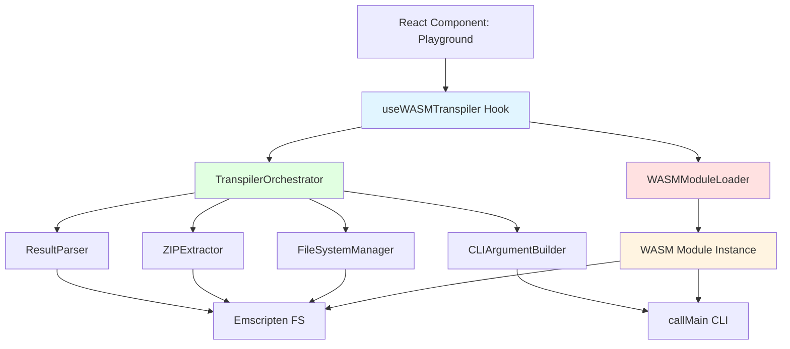
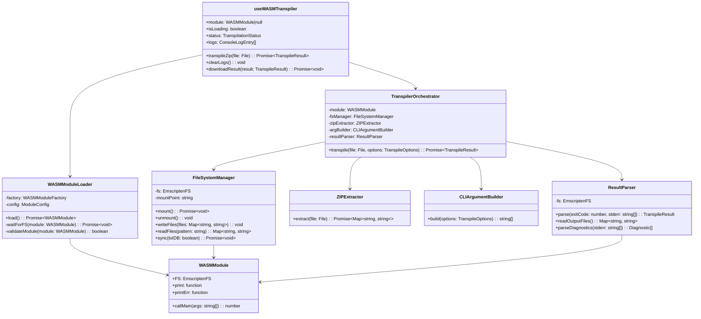
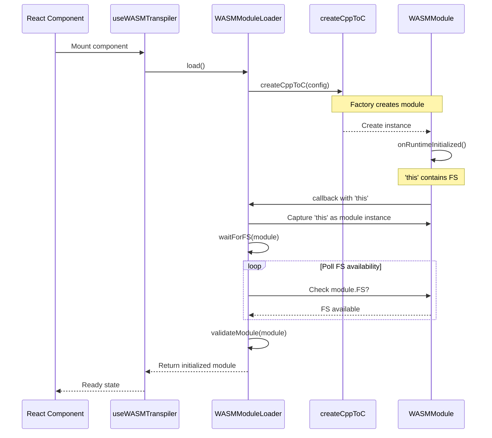
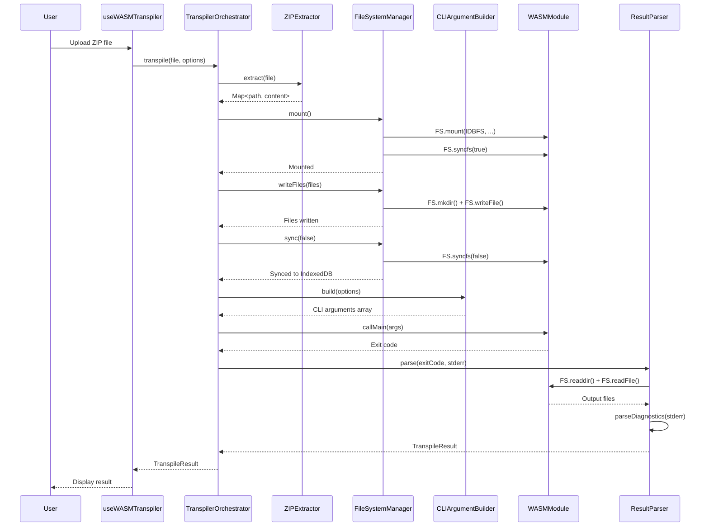
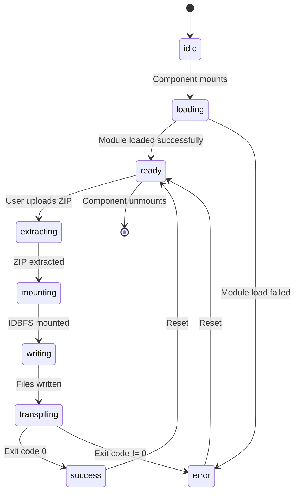
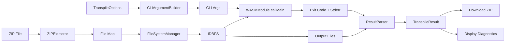
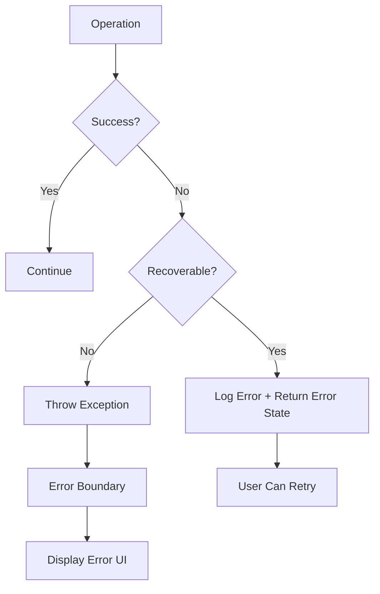

# WASM Transpiler Architecture Design

## Overview

This document defines the architecture for integrating the C++ to C transpiler WASM module into the React-based playground website. The design ensures:

1. **No singleton globals** - Multiple transpiler instances can coexist
2. **Clear separation of concerns** - Each component has a single responsibility
3. **Instance isolation** - Each transpiler instance is completely independent
4. **Type safety** - Full TypeScript type coverage
5. **Error handling** - Robust error recovery and reporting

## Component Architecture



## Class Diagram



## Sequence Diagram: Module Initialization



## Sequence Diagram: Transpilation Flow



## State Machine: Transpilation Status



## Data Flow Diagram



## Key Design Decisions

### 1. No Singleton Globals

**Problem**: Working playground-idbfs.html uses `window.Module = this`

**Solution**:
- Each hook instance creates its own closure
- `moduleInstance` variable scoped to hook instance
- No global state shared between instances

```typescript
export function useWASMTranspiler(): UseWASMTranspilerReturn {
  // Instance-scoped state - unique per hook call
  const moduleRef = useRef<WASMModule | null>(null);
  const [state, setState] = useState<UseWASMTranspilerState>({...});

  // Each mount creates independent module instance
  useEffect(() => {
    let moduleInstance: WASMModule | null = null;
    // ... initialization
  }, []);
}
```

### 2. Module Initialization Pattern

**Problem**: `moduleInstance.FS` undefined after `await createCppToC()`

**Root Cause**: Emscripten's `onRuntimeInitialized` passes the REAL module as `this`, but the promise return value may be different

**Solution**:
```typescript
let moduleInstance: WASMModule | null = null;

await createCppToC({
  onRuntimeInitialized: function() {
    // CRITICAL: 'this' is the real module, capture it
    moduleInstance = this as unknown as WASMModule;
  }
});

// Poll until FS is available
while (!moduleInstance?.FS) {
  await delay(50);
}
```

### 3. Separation of Concerns

| Component | Responsibility | Dependencies |
|-----------|----------------|--------------|
| `useWASMTranspiler` | React integration, state management | WASMModuleLoader, TranspilerOrchestrator |
| `WASMModuleLoader` | Module initialization, FS verification | createCppToC factory |
| `TranspilerOrchestrator` | Coordinate transpilation pipeline | All subsystems |
| `FileSystemManager` | IDBFS operations, file I/O | WASMModule.FS |
| `ZIPExtractor` | ZIP extraction | JSZip |
| `CLIArgumentBuilder` | Build CLI args from options | None |
| `ResultParser` | Parse exit code, diagnostics, output | WASMModule.FS |

### 4. Error Handling Strategy



## Implementation Plan

### Phase 1: Core Infrastructure
1. ✅ Create `WASMModuleLoader` class
2. ✅ Implement `FileSystemManager` class
3. ✅ Build `ZIPExtractor` utility
4. ✅ Create `CLIArgumentBuilder` utility
5. ✅ Implement `ResultParser` class

### Phase 2: Integration
1. ✅ Create `TranspilerOrchestrator` to coordinate components
2. ✅ Update `useWASMTranspiler` to use new architecture
3. ✅ Add comprehensive error handling
4. ✅ Implement logging and progress reporting

### Phase 3: Testing
1. ⏳ Unit test each component independently
2. ⏳ Integration test full transpilation flow
3. ⏳ Test multiple concurrent transpiler instances
4. ⏳ Test error recovery and edge cases

### Phase 4: Optimization
1. ⏳ Implement caching for repeated transpilations
2. ⏳ Add cancellation support for long-running operations
3. ⏳ Optimize file I/O batching
4. ⏳ Add progress streaming for large projects

## Type Definitions

```typescript
// Core module types
interface WASMModule {
  FS: EmscriptenFS;
  callMain(args: string[]): number;
  print: (text: string) => void;
  printErr: (text: string) => void;
}

interface EmscriptenFS {
  mkdir(path: string): void;
  readdir(path: string): string[];
  readFile(path: string, options?: { encoding: 'utf8' }): string | Uint8Array;
  writeFile(path: string, data: string | Uint8Array): void;
  unlink(path: string): void;
  rmdir(path: string): void;
  filesystems: { IDBFS: unknown };
  mount(type: unknown, options: Record<string, unknown>, mountpoint: string): void;
  syncfs(populate: boolean, callback: (err: Error | null) => void): void;
}

// Result types
interface TranspileResult {
  success: boolean;
  c: string;
  h: string;
  acsl: string;
  diagnostics: Diagnostic[];
  exitCode: number;
}

interface Diagnostic {
  line: number;
  column: number;
  message: string;
  severity: 'error' | 'warning' | 'note';
}

// Configuration types
interface TranspileOptions {
  acsl?: ACSLConfig;
  acslLevel?: 'Basic' | 'Full';
  acslOutputMode?: 'Inline' | 'Separate';
  generateACSL?: boolean;
  usePragmaOnce?: boolean;
  enableExceptions?: boolean;
  enableRTTI?: boolean;
  cppStandard?: 'c++11' | 'c++14' | 'c++17' | 'c++20';
  target?: string;
}

interface ACSLConfig {
  statements?: boolean;
  typeInvariants?: boolean;
  axiomatics?: boolean;
  ghostCode?: boolean;
  behaviors?: boolean;
  memoryPredicates?: boolean;
}
```

## Testing Strategy

### Unit Tests

```typescript
describe('WASMModuleLoader', () => {
  it('should initialize module with FS', async () => {
    const loader = new WASMModuleLoader(createCppToC, config);
    const module = await loader.load();
    expect(module.FS).toBeDefined();
    expect(module.FS.mkdir).toBeInstanceOf(Function);
  });

  it('should timeout if FS never becomes available', async () => {
    const loader = new WASMModuleLoader(mockFactory, config);
    await expect(loader.load()).rejects.toThrow('timeout');
  });
});

describe('FileSystemManager', () => {
  it('should mount IDBFS at specified path', async () => {
    const fsm = new FileSystemManager(mockFS, '/project');
    await fsm.mount();
    expect(mockFS.mount).toHaveBeenCalledWith(
      mockFS.filesystems.IDBFS,
      {},
      '/project'
    );
  });

  it('should write files with correct directory structure', () => {
    const files = new Map([
      ['src/main.cpp', 'int main() {}'],
      ['include/header.h', '#pragma once']
    ]);
    fsm.writeFiles(files);
    expect(mockFS.writeFile).toHaveBeenCalledTimes(2);
  });
});
```

### Integration Tests

```typescript
describe('Full Transpilation Flow', () => {
  it('should transpile ZIP file end-to-end', async () => {
    const { transpileZip } = useWASMTranspiler();
    const zipFile = createMockZIP({
      'src/main.cpp': 'class Foo { int x; };'
    });

    const result = await transpileZip(zipFile, { generateACSL: true });

    expect(result.success).toBe(true);
    expect(result.c).toContain('struct Foo');
    expect(result.h).toContain('#pragma once');
  });

  it('should handle multiple concurrent transpilations', async () => {
    const instance1 = useWASMTranspiler();
    const instance2 = useWASMTranspiler();

    const [result1, result2] = await Promise.all([
      instance1.transpileZip(file1),
      instance2.transpileZip(file2)
    ]);

    expect(result1.success).toBe(true);
    expect(result2.success).toBe(true);
    // Verify no cross-contamination
    expect(result1.c).not.toEqual(result2.c);
  });
});
```

## Next Steps

1. **Fix Module Initialization**: Implement proper pattern for capturing `this` from `onRuntimeInitialized`
2. **Test Working Playground**: Verify playground-idbfs.html actually works with current WASM build
3. **Implement Architecture**: Build out components following this design
4. **Add Tests**: Comprehensive unit and integration tests
5. **Document**: Update user-facing documentation with usage examples
