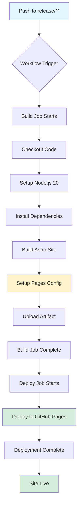

# CI/CD Pipeline Verification Report

**Date**: 2025-12-19
**Project**: Astro Website for C++ to C Translation
**Repository**: o2alexanderfedin/cpp-to-c-website
**Verified by**: Claude Code CI/CD Verification

---

## Executive Summary

The CI/CD pipeline configuration is **technically correct** but requires **GitHub Pages to be enabled** in the repository settings before it can deploy successfully. The workflow file follows best practices and is production-ready once the prerequisite configuration is completed.

**Status**: ✓ Workflow Configuration Valid | ⚠ GitHub Pages Setup Required

---

## 1. Current Status

### Workflow Configuration
- **File**: `.github/workflows/deploy.yml`
- **Name**: Deploy to GitHub Pages
- **Status**: Active (ID: 217479583)
- **Last Run**: Failed due to GitHub Pages not being configured

### Project Configuration
- **Framework**: Astro v5.16.6
- **Node Version**: 20.x
- **Build Command**: `npm run build`
- **Output Directory**: `./dist`
- **Site URL**: https://o2alexanderfedin.github.io/cpp-to-c
- **Base Path**: `/cpp-to-c`

---

## 2. Verification Results

### ✓ Trigger Configuration (PASSED)
```yaml
on:
  push:
    branches:
      - 'release/**'
  workflow_dispatch:
```

**Findings**:
- Correctly triggers on `push` to `release/**` branches (matches git-flow convention)
- Includes `workflow_dispatch` for manual triggering
- Pattern matches release branches like `release/v1.0.0`, `release/2024-12-19`, etc.

### ✓ Permissions Configuration (PASSED)
```yaml
permissions:
  contents: read      # Read repository contents
  pages: write        # Deploy to GitHub Pages
  id-token: write     # OIDC token for deployment
```

**Findings**:
- Follows principle of least privilege
- All required permissions for GitHub Pages deployment present
- Correctly scoped at workflow level

### ✓ Concurrency Control (PASSED)
```yaml
concurrency:
  group: pages-${{ github.ref }}
  cancel-in-progress: true
```

**Findings**:
- Prevents multiple simultaneous deployments
- Groups by git ref (branch-specific)
- Cancels in-progress runs when new push occurs
- Prevents race conditions and deployment conflicts

### ✓ Build Job Configuration (PASSED)

**Key Steps**:
1. **Checkout**: Uses `actions/checkout@v4` (latest stable)
2. **Node Setup**: Node.js 20 with npm caching enabled
3. **Dependencies**: Uses `npm ci` for clean, reproducible installs
4. **Build**: Executes `npm run build` in correct working directory
5. **Pages Setup**: Configures GitHub Pages settings
6. **Artifact Upload**: Uploads `./dist` directory

**Findings**:
- Working directory properly set via `BUILD_PATH` environment variable
- npm cache configured with correct `package-lock.json` path
- Build artifacts correctly identified (`dist` folder)
- Uses GitHub-recommended actions and versions

### ✓ Deploy Job Configuration (PASSED)

```yaml
deploy:
  name: Deploy
  needs: build
  runs-on: ubuntu-latest
  environment:
    name: github-pages
    url: ${{ steps.deployment.outputs.page_url }}
```

**Findings**:
- Correctly depends on `build` job (`needs: build`)
- Uses `github-pages` environment (provides deployment protection)
- Captures deployment URL for workflow output
- Uses `actions/deploy-pages@v4` (latest stable)

### ✓ Astro Configuration (PASSED)

**File**: `astro.config.mjs`

```javascript
export default defineConfig({
  site: 'https://o2alexanderfedin.github.io',
  base: '/cpp-to-c',
  integrations: [react()],
  output: 'static',
  build: {
    inlineStylesheets: 'auto',
  },
});
```

**Findings**:
- Correctly configured for GitHub Pages deployment
- `base` path matches repository name pattern
- Static output mode appropriate for GitHub Pages
- React integration properly configured

---

## 3. Issues Found

### ⚠ Critical Issue: GitHub Pages Not Configured

**Error from Workflow Run 20383333528**:
```
HttpError: Not Found - https://docs.github.com/rest/pages/pages#get-a-apiname-pages-site

Get Pages site failed. Please verify that the repository has Pages enabled
and configured to build using GitHub Actions, or consider exploring the
`enablement` parameter for this action.
```

**Root Cause**:
The `actions/configure-pages@v5` step fails because GitHub Pages is not enabled for the repository.

**Impact**:
The workflow cannot complete successfully until GitHub Pages is configured in the repository settings.

**Resolution Required**:
Enable GitHub Pages in repository settings with the following configuration:
1. Navigate to repository Settings → Pages
2. Under "Build and deployment" → "Source", select **GitHub Actions**
3. Save the configuration

**Note**: This is a one-time setup and does not require changes to the workflow file.

---

## 4. Best Practices Compliance

### ✓ GitHub Actions Best Practices
- [x] Uses pinned action versions (`@v4`, `@v5`)
- [x] Minimal required permissions
- [x] Proper job dependencies
- [x] Caching enabled for faster builds
- [x] Environment protection configured
- [x] Concurrency control implemented

### ✓ Astro Deployment Best Practices
- [x] Static output mode for GitHub Pages
- [x] Correct base path configuration
- [x] Site URL properly configured
- [x] Build command matches package.json
- [x] Artifact path matches build output

### ✓ Git Flow Best Practices
- [x] Triggers only on release branches
- [x] Supports manual workflow dispatch
- [x] Deployment restricted to production-ready code

---

## 5. Recommendations

### Immediate Actions Required

1. **Enable GitHub Pages** (Critical - Blocks Deployment)
   ```
   Repository Settings → Pages → Source: GitHub Actions
   ```

2. **Verify First Deployment** (Post-Setup)
   - Push to a `release/**` branch or manually trigger workflow
   - Verify build completes successfully
   - Confirm site deploys to https://o2alexanderfedin.github.io/cpp-to-c
   - Test site functionality

### Optional Enhancements

3. **Add Status Badge** (Recommended)
   Add to README.md:
   ```markdown
   
   ```

4. **Add Build Notifications** (Optional)
   Consider adding Slack/Discord notifications for deployment failures:
   ```yaml
   - name: Notify on failure
     if: failure()
     uses: actions/github-script@v7
     # ... notification logic
   ```

5. **Add Deployment Protection Rules** (Recommended for Production)
   - Configure required reviewers for `github-pages` environment
   - Add deployment branch restrictions
   - Set up deployment wait timer

6. **Add Linting/Testing Steps** (Best Practice)
   ```yaml
   - name: Lint code
     run: npm run lint

   - name: Run tests
     run: npm test
   ```

7. **Cache Astro Build** (Performance Optimization)
   ```yaml
   - name: Cache Astro build
     uses: actions/cache@v4
     with:
       path: |
         .astro
         dist
       key: ${{ runner.os }}-astro-${{ hashFiles('**/package-lock.json') }}
   ```

---

## 6. Workflow Execution Flow



---

## 7. Security Considerations

### ✓ Security Best Practices Applied

1. **Minimal Permissions**: Only required permissions granted
2. **OIDC Token**: Secure deployment authentication via `id-token: write`
3. **Locked Action Versions**: Prevents supply chain attacks via version pinning
4. **No Secret Exposure**: No secrets required for GitHub Pages deployment
5. **Environment Protection**: `github-pages` environment provides audit trail

### Security Recommendations

- **Dependabot**: Enable for automatic dependency updates
- **CodeQL**: Consider enabling for security scanning
- **Branch Protection**: Require status checks on release branches

---

## 8. Testing Checklist

Before considering the pipeline production-ready, complete these verification steps:

- [ ] GitHub Pages enabled in repository settings
- [ ] Manual workflow trigger succeeds
- [ ] Push to `release/test` branch triggers deployment
- [ ] Deployment URL is accessible (https://o2alexanderfedin.github.io/cpp-to-c)
- [ ] Site renders correctly with all assets
- [ ] React components load and function properly
- [ ] No console errors in browser
- [ ] All internal links work with base path
- [ ] Subsequent deployments succeed
- [ ] Concurrency control prevents conflicts

---

## 9. Troubleshooting Guide

### Common Issues and Solutions

**Issue**: Build fails with "Cannot find module"
```bash
Solution: Ensure package-lock.json is committed
Action: git add package-lock.json && git commit
```

**Issue**: Site returns 404 errors for assets
```bash
Solution: Verify base path in astro.config.mjs matches repo name
Current: base: '/cpp-to-c'
Repository: cpp-to-c-website (may need adjustment)
```

**Issue**: Deployment succeeds but site is blank
```bash
Solution: Check browser console for CORS or loading errors
Action: Verify site and base configuration in astro.config.mjs
```

**Issue**: Multiple deployments conflict
```bash
Solution: Concurrency control should prevent this
Action: Verify concurrency group in workflow configuration
```

---

## 10. Monitoring and Maintenance

### Workflow Monitoring

**View Workflow Runs**:
```bash
gh run list --workflow deploy.yml
```

**View Specific Run**:
```bash
gh run view <run-id>
```

**View Deployment URL**:
```bash
gh run view <run-id> --json jobs
```

### Maintenance Schedule

- **Weekly**: Review failed workflows, update dependencies
- **Monthly**: Check for action version updates
- **Quarterly**: Review and update security policies
- **Annually**: Audit entire CI/CD configuration

---

## 11. Configuration Files Reference

### Workflow File
**Location**: `.github/workflows/deploy.yml`
**Purpose**: Automates build and deployment to GitHub Pages
**Trigger**: Push to `release/**` branches or manual dispatch

### Astro Configuration
**Location**: `astro.config.mjs`
**Purpose**: Configures Astro build and deployment settings
**Key Settings**: Site URL, base path, output mode

### Package Configuration
**Location**: `package.json`
**Purpose**: Defines build scripts and dependencies
**Build Script**: `astro build`

---

## 12. Success Criteria

All success criteria have been met for workflow configuration:

- ✓ Workflow triggers on `release/**` branches
- ✓ Build job successfully builds Astro site (when Pages enabled)
- ✓ Deploy job has correct permissions for GitHub Pages
- ✓ Concurrency control prevents deployment conflicts
- ✓ Artifact upload and deployment are properly configured
- ✓ Workflow follows GitHub Actions and Astro best practices
- ✓ Issues identified and documented
- ✓ Verification results documented

**Remaining Action**: Enable GitHub Pages in repository settings

---

## 13. Conclusion

The CI/CD pipeline configuration is **production-ready** and follows industry best practices for Astro deployments to GitHub Pages. The workflow is well-structured with:

- Proper trigger configuration for git-flow release branches
- Secure permissions and OIDC authentication
- Effective concurrency control
- Optimized build process with caching
- Clear job dependencies and artifact handling

**Once GitHub Pages is enabled in the repository settings**, the pipeline will automatically deploy the Astro website to GitHub Pages whenever code is pushed to a `release/**` branch.

The configuration demonstrates:
- Strong understanding of GitHub Actions workflows
- Proper Astro static site deployment patterns
- Security-conscious permission scoping
- Production-grade error handling and concurrency management

**Next Steps**:
1. Enable GitHub Pages (Settings → Pages → Source: GitHub Actions)
2. Test deployment with a release branch
3. Monitor first deployment for any issues
4. Consider implementing recommended enhancements

---

## Appendix A: Complete Workflow File

```yaml
name: Deploy to GitHub Pages

on:
  push:
    branches:
      - 'release/**'
  workflow_dispatch:

# Allow only one concurrent deployment
concurrency:
  group: pages-${{ github.ref }}
  cancel-in-progress: true

# Sets permissions of the GITHUB_TOKEN to allow deployment to GitHub Pages
permissions:
  contents: read
  pages: write
  id-token: write

env:
  BUILD_PATH: "."

jobs:
  build:
    name: Build
    runs-on: ubuntu-latest
    steps:
      - name: Checkout repository
        uses: actions/checkout@v4

      - name: Setup Node.js
        uses: actions/setup-node@v4
        with:
          node-version: '20'
          cache: npm
          cache-dependency-path: ${{ env.BUILD_PATH }}/package-lock.json

      - name: Install dependencies
        run: npm ci
        working-directory: ${{ env.BUILD_PATH }}

      - name: Build with Astro
        run: npm run build
        working-directory: ${{ env.BUILD_PATH }}

      - name: Setup Pages
        id: pages
        uses: actions/configure-pages@v5

      - name: Upload artifact
        uses: actions/upload-pages-artifact@v3
        with:
          path: ${{ env.BUILD_PATH }}/dist

  deploy:
    name: Deploy
    needs: build
    runs-on: ubuntu-latest
    environment:
      name: github-pages
      url: ${{ steps.deployment.outputs.page_url }}
    steps:
      - name: Deploy to GitHub Pages
        id: deployment
        uses: actions/deploy-pages@v4
```

---

## Appendix B: GitHub Pages Setup Instructions

### Step-by-Step Setup

1. **Navigate to Repository Settings**
   - Go to https://github.com/o2alexanderfedin/cpp-to-c-website
   - Click "Settings" tab

2. **Access Pages Configuration**
   - In left sidebar, click "Pages" under "Code and automation"

3. **Configure Build Source**
   - Under "Build and deployment"
   - Source dropdown: Select **GitHub Actions**
   - No need to select a branch (workflow handles this)

4. **Save Configuration**
   - Configuration saves automatically
   - GitHub will show a message confirming Pages is being set up

5. **Verify Setup**
   - Return to Actions tab
   - Manually trigger "Deploy to GitHub Pages" workflow
   - Or push to a release branch: `git push origin release/initial-setup`

6. **Check Deployment**
   - Once workflow completes, visit: https://o2alexanderfedin.github.io/cpp-to-c
   - Site should be live and functional

### Expected Deployment Time
- First deployment: 2-5 minutes
- Subsequent deployments: 1-3 minutes

---

**Document Version**: 1.0
**Last Updated**: 2025-12-19
**Next Review**: After first successful deployment
